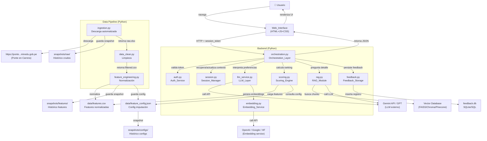
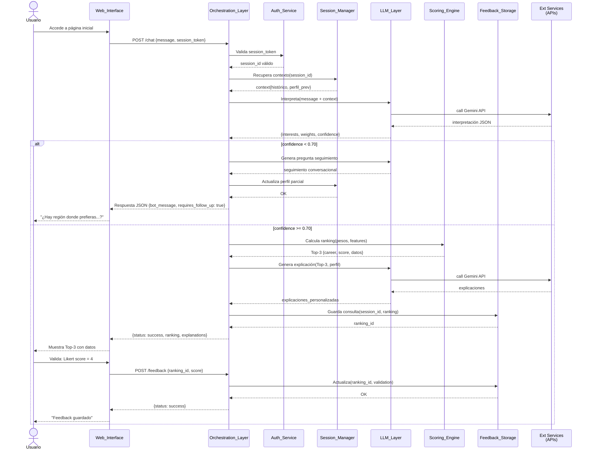
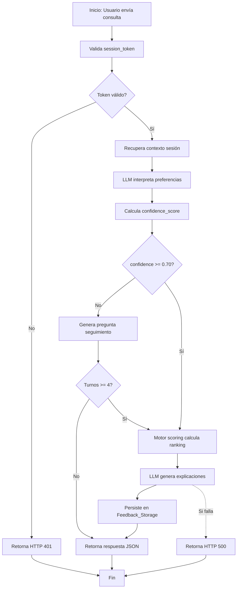

# design.md

## Descripción General

CareerMatch Perú es un sistema de recomendación de carreras universitarias que opera mediante un asistente conversacional basado en LLM, integrado con un motor de evaluación multi-criterio transparente y auditable. El flujo principal es: 

(1) usuario inicia sesión autenticada, 

(2) expresa preferencias en lenguaje natural a través de interfaz web conversacional, 

(3) el **LLM_Layer** interpreta preferencias y detecta información incompleta, 

(4) si falta información, el sistema genera preguntas contextuales iterativamente hasta alcanzar confianza >= 0.70, 

(5) una vez interpretadas, el **Scoring_Engine** calcula indicadores de concordancia multi-criterio para todas las combinaciones carrera–universidad, ordena por score descendente y retorna Top-3, 

(6) el **LLM_Layer** redacta explicaciones personalizadas,

(7) el usuario valida con escala Likert y la sesión se persiste en **Feedback_Storage** para análisis futuro.   

El diseño enfatiza determinismo (cualquier input idéntico genera ranking idéntico), reproducibilidad (snapshots versionados permiten auditar exactamente qué datos y configuración se usó), aislamiento de datos por `session_id`, y degradación controlada (si componentes fallan, el sistema retorna mejor respuesta posible con información disponible). La arquitectura es modular, permitiendo reemplazo de componentes (p.ej., método de afinidad, estrategia de scoring, proveedor LLM) sin afectar otros.

---

## Arquitectura

### Diagrama de Componentes



### Diagrama de Secuencia



### Diagrama de Flujo



---

## Módulos y Interfaces

### `backend/auth.py` — Auth_Service

**Responsabilidad:** Crear, validar, almacenar y revocar tokens de sesión autenticados. Garantiza aislamiento de datos entre usuarios.

**API Pública:**

```python
class AuthService:
    def create_session(self) -> tuple[str, str]:
        """
        Crea nueva sesión autenticada.
        
        Returns:
            (session_id: UUID v4, session_token: criptográfico opaco)
        
        Comportamiento:
        - Genera session_id único: UUID v4
        - Genera session_token seguro: 32+ bytes de entropía (secrets.token_urlsafe)
        - Token es opaco: no contiene información decibrable
        - Token nunca es retornado al cliente sin estar en estructura de respuesta
        
        Errores:
        - GeneralError si generación de entropía falla
        """
    
    def validate_token(self, session_token: str) -> str | None:
        """
        Valida token y retorna session_id asociado.
        
        Args:
            session_token: token a validar
        
        Returns:
            session_id si válido, None si inválido o expirado
        
        Comportamiento:
        - Verifica que token existe en almacén de tokens activos
        - Verifica que no ha expirado (session_timeout_minutes)
        - Retorna session_id asociado
        - No falla con excepción; retorna None para inválido (HTTP 401)
        
        Fallback:
        - Token expirado → None
        - Token no existe → None
        """
    
    def revoke_token(self, session_token: str) -> None:
        """
        Revoca token inmediatamente.
        
        Comportamiento:
        - Marca token como revocado en almacén
        - Limpia datos de contexto de sesión si lo hay
        
        Notas:
        - No falla si token ya está revocado
        """
    
    def is_token_valid(self, session_token: str) -> bool:
        """Helper booleano para validación rápida."""
    
    def get_session_timeout_minutes(self) -> int:
        """
        Retorna duración configurada de sesión en minutos.
        
        Default: 480 (8 horas)
        Configurable: variable entorno SESSION_TIMEOUT_MINUTES
        """
```

**Notas de comportamiento:**
- Token es almacenado en servidor (en memoria o cache; no en cliente).
- Si token en cliente es compromised, no permite acceso a otros usuarios (session_id es único).
- Revocación es inmediata: en siguiente request, token retorna 401.

---

### `backend/session.py` — Session_Manager

**Responsabilidad:** Mantener contexto conversacional multi-turno por sesión, actualizar perfil interpretado, rastrear confianza y estado de diálogo.

**API Pública:**

```python
class SessionContext:
    """Modelo de contexto de sesión."""
    session_id: str
    created_at: datetime
    last_activity: datetime
    conversation_turns: list[dict]  # [{turn: int, message: str, role: 'user'|'bot', timestamp}]
    user_profile: UserProfile | None  # Definido en Modelos de Datos
    confidence_score: float  # [0.0, 1.0]
    missing_info: list[str]  # Campos del perfil que faltan
    suggested_follow_up: str | None  # Pregunta conversacional generada
    dialogue_state: str  # 'gathering_info' | 'ready_for_recommendation'
    ranking_history: list[dict]  # Histórico de rankings generados


class SessionManager:
    def create_context(self, session_id: str) -> SessionContext:
        """
        Crea nuevo contexto de sesión vacío.
        
        Returns:
            SessionContext con valores iniciales
        
        Iniciales:
        - conversation_turns: []
        - user_profile: None
        - confidence_score: 0.0
        - dialogue_state: 'gathering_info'
        """
    
    def get_context(self, session_id: str) -> SessionContext | None:
        """
        Recupera contexto de sesión existente.
        
        Returns:
            SessionContext si existe, None si no
        
        Comportamiento:
        - Busca en almacén de sesiones activas por session_id
        - Retorna copiar para evitar mutaciones accidentales
        """
    
    def update_profile(
        self,
        session_id: str,
        new_profile_data: dict,  # {interests: [...], salary_priority: float, ...}
    ) -> None:
        """
        Actualiza perfil interpretado del usuario con nueva información.
        
        Comportamiento:
        - Si user_profile es None, crea uno nuevo
        - Merge incremental: nueva info refina/completa, no anula previa
        - Recalcula confidence_score y missing_info después de merge
        - Actualiza last_activity
        - Logs de auditoría registran qué campos fueron actualizados
        
        Ejemplo:
            Turno 1 input: "Me gustan matemáticas"
            user_profile = {interests: ["matemáticas"], ...}
            
            Turno 2 input: "También me gusta diseño"
            update_profile() → {interests: ["matemáticas", "diseño"], ...}
        """
    
    def append_turn(
        self,
        session_id: str,
        message: str,
        role: str,  # 'user' | 'bot'
    ) -> None:
        """
        Agrega turno a histórico conversacional.
        
        Comportamiento:
        - Incrementa turn counter automáticamente
        - Registra timestamp
        - Persiste en logging para auditoría
        """
    
    def calculate_confidence(
        self,
        user_profile: UserProfile,
    ) -> float:
        """
        Calcula confidence_score basado en completitud de perfil.
        
        Formula:
            confidence = (campos_no_null / campos_requeridos_minimo)
            
        Campos requeridos mínimo: 4
            - interests (array no vacío)
            - salary_priority (float [0,1])
            - cost_sensitivity (float [0,1])
            - admission_tolerance (float [0,1])
        
        Returns:
            float [0.0, 1.0]
        
        Ejemplo:
            4/4 campos: 1.0
            2/4 campos: 0.5
            0/4 campos: 0.0
        """
    
    def should_transition_to_recommendation(
        self,
        session_id: str,
    ) -> bool:
        """
        Determina si contexto está listo para calcular ranking.
        
        Returns:
            True si confidence_score >= 0.70, False en otro caso
        """
    
    def increment_dialogue_turn_count(
        self,
        session_id: str,
    ) -> int:
        """Incrementa contador de turnos de seguimiento. Retorna nuevo valor."""
    
    def has_exceeded_max_dialogue_turns(
        self,
        session_id: str,
        max_turns: int = 4,
    ) -> bool:
        """
        Verifica si se alcanzó máximo de turnos de seguimiento.
        
        Default max: 4 (Requerimiento 4 criterio 6)
        """
    
    def clear_context(self, session_id: str) -> None:
        """
        Limpia contexto de sesión (para reset parcial dentro misma sesión).
        
        Comportamiento:
        - Borra conversation_turns histórico
        - Reinicia user_profile a None
        - Reinicia confidence_score a 0.0
        - Mantiene session_id y timestamp de creación
        """
```

**Notas de comportamiento:**
- Almacén de sesiones puede ser en-memory (demo) o persistente (producción).
- Actualización de perfil es incremental (merge), no reemplazo.
- Confidence se recalcula automáticamente en cada actualización.

---

### `backend/llm_service.py` — LLM_Layer

**Responsabilidad:** Interpretar preferencias en lenguaje natural, detectar información faltante, generar preguntas conversacionales y redactar explicaciones personalizadas.

**API Pública:**

```python
class LLMService:
    def __init__(self, provider: str, model: str, api_key: str | None = None):
        """
        Inicializa servicio LLM.
        
        Args:
            provider: 'gemini' | 'openai' | 'local'
            model: ej 'gemini-1.5-flash', 'gpt-4o-mini'
            api_key: clave de autenticación (si aplica)
        
        Comportamiento:
        - Valida que provider y model sean compatibles
        - Inicializa cliente del provider
        """
    
    def interpret_preferences(
        self,
        user_input: str,
        session_context: SessionContext | None = None,
    ) -> InterpretationResult:
        """
        Interpreta preferencias expresadas en lenguaje natural.
        
        Args:
            user_input: Consulta del usuario en español
            session_context: Contexto previo (para continuidad conversacional)
        
        Returns:
            InterpretationResult con estructura:
            {
                interests: list[str],
                salary_priority: float [0,1],
                cost_sensitivity: float [0,1],
                admission_tolerance: float [0,1],
                geographic_preference: str | null,
                institution_type_preference: str | null,
                missing_info: list[str],
                confidence_score: float [0,1],
                confidence_reasoning: str,
                suggested_follow_up: str | null,
                raw_llm_response: str  # Para auditoría
            }
        
        Comportamiento:
        - Usa few-shot prompting con mínimo 3 ejemplos
        - Genera JSON estructurado validado
        - Si LLM retorna JSON inválido, reintenta máximo 3 veces
        - Si 3 intentos fallan, lanza JSONParseError
        - Si respuesta es ambigua, documenta en confidence_reasoning
        
        Timeout:
        - Máximo 3 segundos por llamada a LLM
        - Si timeout, relanza TimeoutError (manejado por Orchestration)
        
        Errores:
        - JSONParseError: si JSON es inválido tras 3 intentos
        - TimeoutError: si respuesta tarda > 3s
        - APIError: si API del proveedor falla
        """
    
    def generate_follow_up_question(
        self,
        current_profile: UserProfile,
        missing_info: list[str],
        conversation_history: list[dict],
    ) -> str:
        """
        Genera pregunta conversacional para completar información faltante.
        
        Args:
            current_profile: Perfil parcial conocido
            missing_info: Lista de campos que faltan
            conversation_history: Turnos previos para contexto
        
        Returns:
            Pregunta en español peruano, abierta, conversacional, no invasiva
        
        Restricciones (Requerimiento 4):
        - Pregunta DEBE ser abierta (no SÍ/NO)
        - DEBE mencionar por qué la información es útil
        - NO DEBE repetir información ya mencionada
        - DEBE ser contextual al perfil parcial
        
        Ejemplo correcto:
            "¿Hay alguna región del Perú donde prefieras estudiar, 
             o tienes flexibilidad? Algunos estudiantes lo dejan 
             abierto para más opciones."
        
        Ejemplo incorrecto:
            "¿Qué región? (Respuesta obligatoria)"
        
        Comportamiento:
        - Usa system prompt v1 con ejemplos few-shot
        - No genera pregunta "agresiva" o directa
        - Si no hay información faltante clara, retorna string vacío
        """
    
    def generate_explanation(
        self,
        ranking_position: int,
        career: str,
        institution: str,
        concordancia_score: float,
        scores_by_criterion: dict,  # {affinity, salary, cost, admission}
        user_profile: UserProfile,
        verifiable_data: dict,  # {monthly_income, annual_cost, admission_rate, duration}
    ) -> str:
        """
        Redacta explicación personalizada de recomendación.
        
        Args:
            ranking_position: 1, 2 o 3 (ranking position)
            career, institution: Nombres de carrera y universidad
            concordancia_score: Score final [0,1]
            scores_by_criterion: Desglose por criterio
            user_profile: Perfil del usuario para contextualización
            verifiable_data: Datos duros de Ponte en Carrera
        
        Returns:
            Texto explicación de 3–5 oraciones en español peruano
        
        Comportamiento:
        - Debe incluir:
            (a) Qué criterio/característica coincide con perfil
            (b) Al menos 1 dato verificable (ingresos, costo, tasa admisión)
            (c) Conexión beneficio-usuario
        - NO inventa datos; todos números vienen de verifiable_data
        - Cita fuente implícitamente: "según datos oficiales del MINEDU"
        - Usa system prompt v1 con ejemplos few-shot
        
        Ejemplo correcto:
            "Te recomendamos Estadística en la UNMSM porque 
             tu afinidad con el análisis de datos es muy alta (85/100). 
             Esta carrera ofrece uno de los mejores ingresos 
             (S/. 3,200/mes) y es accesible financieramente 
             (S/. 1,200/año). Aunque es selectiva (18% de admisión), 
             es factible si tienes fortaleza en matemáticas."
        
        Fallback (si LLM falla):
            "Recomendamos [carrera] en [universidad] porque alinea 
             bien con tus intereses. Ingresos promedio: [valor]. 
             Costo: [valor]. Tasa de admisión: [valor]."
        
        Timeout:
        - Máximo 3 segundos
        
        Errores:
        - Si LLM falla, utiliza fallback templated
        """
    
    def validate_weights(
        self,
        weights: dict,  # {affinity: float, salary: float, cost: float, admission: float}
        tolerance: float = 0.01,
    ) -> bool:
        """
        Valida que pesos sean válidos: cada wᵢ ∈ [0,1] y suma ≈ 1.0.
        
        Args:
            weights: Dict con 4 pesos
            tolerance: Tolerancia en suma (default 0.01)
        
        Returns:
            True si válidos, False en otro caso
        
        Validaciones:
        - Cada peso en rango [0, 1]
        - Suma total: 1.0 ± tolerance
        - Todos pesos presentes en dict
        """
```

**Notas de comportamiento:**
- Sistema prompt v1 debe incluir mínimo 3 ejemplos few-shot de diferentes perfiles.
- Si LLM externa falla 3 veces, no reintentar infinitamente; fallar explícitamente para que Orchestration maneje.
- Logging debe registrar pesos generados, confidence, y cualquier anomalía detectada.

---

### `backend/scoring.py` — Scoring_Engine

**Responsabilidad:** Calcular indicadores de concordancia multi-criterio, generar rankings determinísticos y aplicar filtros.

**API Pública:**

```python
class ScoringEngine:
    def __init__(self, features_csv_path: str, config_json_path: str):
        """
        Inicializa motor de scoring con features normalizadas.
        
        Args:
            features_csv_path: Ruta a data/features.csv
            config_json_path: Ruta a data/feature_config.json
        
        Comportamiento:
        - Carga features.csv en memoria (Pandas DataFrame)
        - Carga configuración desde JSON
        - Valida que columnas requeridas existan
        
        Errores:
        - FileNotFoundError si archivos no existen
        - ValueError si esquema incorrecto
        """
    
    def calculate_concordancia_score(
        self,
        weights: dict,  # {affinity: float, salary: float, cost: float, admission: float}
        affinity_scores: list[float],  # [0,1] por cada carrera en order
        career_id: int,  # Index en dataset
    ) -> float:
        """
        Calcula score de una carrera individual usando fórmula.
        
        Formula base (suma ponderada):
            score = w_affinity * affinity + w_salary * income_score + 
                    w_cost * cost_score + w_admission * admission_score
        
        Args:
            weights: Pesos {affinity, salary, cost, admission}
            affinity_scores: Array de afinidades pre-calculadas
            career_id: Índice en dataset features.csv
        
        Returns:
            float [0, 1]
        
        Comportamiento:
        - Busca columnas: income_score, cost_score, admission_score en dataset
        - Usa affinity_scores[career_id]
        - Todos operandos son [0,1], resultado es [0,1]
        - Si alguna variable faltante (NULL), marcar carrera como "no evaluable"
        
        Determinismo:
        - Mismo input → mismo score en todos los casos
        - Sin redondeos intermedios que causen varianza
        """
    
    def rank_all_careers(
        self,
        weights: dict,
        affinity_scores: list[float],
        geographic_filter: str | None = None,
        institution_type_filter: str | None = None,
        budget_max: float | None = None,
    ) -> list[dict]:
        """
        Calcula ranking completo aplicando filtros opcionales.
        
        Args:
            weights: Pesos dinámicos
            affinity_scores: Array de afinidades por carrera
            geographic_filter: Región (ej "Lima") o None para ningún filtro
            institution_type_filter: 'pública', 'privada', o None
            budget_max: Costo máximo aceptable o None
        
        Returns:
            List de dicts ordenados por score descendente:
            [
                {
                    rank: 1,
                    career: "Estadística",
                    institution: "UNMSM",
                    concordancia_score: 0.847,
                    scores_by_criterion: {
                        affinity: 0.85,
                        salary: 0.82,
                        cost: 0.90,
                        admission: 0.60
                    },
                    verifiable_data: {
                        monthly_income: 3200,
                        annual_cost: 1200,
                        admission_rate: 18,
                        duration_years: 5
                    }
                },
                ...
            ]
        
        Comportamiento:
        - Calcula concordancia para TODAS las carreras
        - Aplica filtros: geographic, institution_type, budget
            - geographic: if filter="Lima", retener si location=="Lima"
            - institution_type: if filter="pública", retener si mgmt=="público"
            - budget: retener si annual_cost <= budget_max
        - Ordena resultado por concordancia_score DESC
        - Empatados (diff < 0.001): desempatador alfabético por institution
        - Retorna completo (no truncado a Top-N aquí; eso es responsabilidad de Orchestration)
        
        Determinismo:
        - Todos los inputs son determinísticos → output determinístico
        - Desempate alfabético garantiza orden único
        
        Timeout:
        - Para dataset 1500 combinaciones: ≤ 1 segundo
        
        Errores:
        - Si algún filtro invalida: loguear warning pero no fallar,
          simplemente no aplicar ese filtro
        """
    
    def get_top_n(
        self,
        ranked_list: list[dict],
        n: int = 3,
    ) -> list[dict]:
        """
        Extrae Top-N de ranking completo.
        
        Args:
            ranked_list: Resultado de rank_all_careers
            n: Número de resultados (default 3, rango 1–10)
        
        Returns:
            Primeros N elementos de ranked_list
        
        Validación:
        - Si n < 1 o n > 10, clampear a rango [1, 10]
        """
    
    def reload_features(self) -> None:
        """
        Recarga features.csv desde disco (para cambios de datos sin reiniciar servidor).
        
        Comportamiento:
        - Lee features.csv nuevamente
        - Valida schema
        - Reemplaza dataset en memoria
        
        Errores:
        - FileNotFoundError, ValueError: propagados para manejo por Orchestration
        """
```

**Notas de comportamiento:**
- Dataset features.csv se carga en memoria al inicializar. Para datasets > 100MB, considerar carga lazy (decisión de diseño).
- Filtros son opcionales; si no especificados, aplican a todas las combinaciones.
- Scores son determinísticos: mismo input → mismo ranking en 100% de ejecuciones.

---

### `backend/rag.py` — RAG_Module

**Responsabilidad:** Permitir consultas conversacionales sobre detalles de carreras recomendadas mediante recuperación + generación sobre documentos embeddeados.

**API Pública:**

```python
class RAGModule:
    def __init__(
        self,
        vector_db_type: str,  # 'faiss' | 'pinecone' | 'chroma' | 'weaviate'
        vector_db_config: dict | None = None,
        embedding_service: EmbeddingService,
    ):
        """
        Inicializa módulo RAG.
        
        Args:
            vector_db_type: Tipo de vector DB a usar
            vector_db_config: Configuración específica (URLs, claves, etc.)
            embedding_service: Instancia de EmbeddingService para embeddings
        
        Comportamiento:
        - Inicializa conexión a vector DB
        - Valida que al menos 1 carrera piloto esté indexada
        """
    
    def is_career_available(self, career: str) -> bool:
        """
        Verifica si carrera tiene RAG disponible.
        
        Args:
            career: Nombre de carrera (ej "Estadística")
        
        Returns:
            True si documentos indexados, False en otro caso
        
        Comportamiento:
        - Verifica si existen chunks en vector DB asociados a career
        - Búsqueda rápida sin embeddings
        """
    
    def query(
        self,
        career: str,
        question: str,
        top_k: int = 3,
    ) -> RagResponse:
        """
        Realiza consulta sobre detalles de carrera.
        
        Args:
            career: Nombre de carrera
            question: Pregunta en español (ej "¿Qué cursos lleva?")
            top_k: Número de chunks a recuperar (default 3)
        
        Returns:
            RagResponse con:
            {
                answer: str,  # Respuesta generada por LLM
                sources: list[str],  # Documentos citados
                confidence: float,  # [0,1]
                status: str  # 'success' | 'no_documents' | 'error'
            }
        
        Comportamiento:
        - Genera embedding de pregunta
        - Busca Top-K chunks en vector DB (filtered por career)
        - Pasa chunks + pregunta a LLM con prompt RAG
        - LLM genera respuesta
        - Extrae y retorna fuentes
        
        Timeout:
        - Máximo 2 segundos total (retrieval + generación)
        
        Errores:
        - Si career no tiene RAG: retornar RagResponse con status='no_documents'
        - Si embedding falla: retornar status='error'
        - Si LLM falla: retornar status='error'
        """
    
    def index_career_documents(
        self,
        career: str,
        documents: list[str],  # Textos de PDFs procesados
        metadata: dict | None = None,
    ) -> None:
        """
        Indexa documentos de una carrera en vector DB.
        
        Args:
            career: Nombre de carrera
            documents: Textos a indexar (ya procesados, no PDFs crudos)
            metadata: {plan_curricular: bool, perfil_profesional: bool, ...}
        
        Comportamiento:
        - Divide textos en chunks (~500 caracteres, 50 char overlap)
        - Genera embeddings de cada chunk
        - Almacena en vector DB con metadata {career, source, chunk_id}
        
        Notas:
        - Esta función es llamada durante setup/importación de datos
        - Para demo: solo 3–5 carreras piloto
        """
    
    def get_available_careers(self) -> list[str]:
        """Retorna lista de carreras con RAG disponible."""
```

**Notas de comportamiento:**
- RAG es OPCIONAL: si no está disponible para una carrera, sistema continúa sin error.
- Vector DB agnóstico: puede ser FAISS local o servicio cloud.
- Embedding service es inyectable: permite cambiar proveedor sin modificar RAG_Module.

---

### `backend/feedback.py` — Feedback_Storage

**Responsabilidad:** Persistir consultas, perfiles, rankings, explicaciones y validaciones de usuario en base de datos, construyendo histórico para análisis y entrenamiento futuro.

**API Pública:**

```python
class FeedbackStorage:
    def __init__(self, db_url: str):
        """
        Inicializa almacenamiento de feedback.
        
        Args:
            db_url: URI de base de datos (sqlite, postgresql, etc.)
                    Ej: 'sqlite:///feedback.db', 'postgresql://...'
        
        Comportamiento:
        - Conecta a base de datos
        - Crea tablas si no existen (schema migration)
        """
    
    def save_ranking(
        self,
        session_id: str,
        user_input: str,
        profile_interpreted: dict,
        weights_generated: dict,
        ranking_generated: list[dict],
        timestamp: datetime,
    ) -> str:
        """
        Guarda consulta y ranking generado (sin validación usuario aún).
        
        Args:
            session_id: ID única de sesión
            user_input: Consulta original del usuario
            profile_interpreted: Dict interpretado por LLM
            weights_generated: Pesos dinámicos
            ranking_generated: Top-3 ranking
            timestamp: Fecha/hora de generación
        
        Returns:
            ranking_id: Identificador único del ranking para vincular feedback
        
        Comportamiento:
        - Inserta registro en tabla feedback con todos los datos
        - Genera ranking_id único (uuid + timestamp hash)
        - Persiste completo: inputs, outputs, pesos, scores
        
        Timeout:
        - Máximo 5 segundos (incluye retry si DB temporalmente no disponible)
        
        Errores:
        - Si DB no disponible tras reintento exponencial:
            - Logea error
            - Almacena en queue local en-memory
            - Retorna ranking_id provisional
            - En siguiente oportunidad, sincroniza queue
        """
    
    def update_validation(
        self,
        ranking_id: str,
        validation_score: int,  # 1–5 escala Likert
        selected_career: str | None = None,
        notes: str | None = None,
        timestamp: datetime | None = None,
    ) -> None:
        """
        Actualiza registro con validación del usuario.
        
        Args:
            ranking_id: ID del ranking a actualizar
            validation_score: Escala 1–5
            selected_career: Carrera elegida por usuario (opcional)
            notes: Comentarios libres (opcional)
            timestamp: Fecha de validación (auto si None)
        
        Comportamiento:
        - Localiza registro por ranking_id
        - Actualiza campos user_validation
        - Calcula timestamp automáticamente si no provisto
        
        Validaciones:
        - validation_score ∈ [1, 5]; si fuera de rango, rechazar
        - ranking_id debe existir; si no, retornar error
        
        Errores:
        - ranking_id inexistente: ValueError
        - validation_score inválido: ValueError
        - DB no disponible: reintento + queue fallback (igual que save_ranking)
        """
    
    def get_ranking_by_id(self, ranking_id: str) -> dict | None:
        """
        Recupera ranking completo (para reproducibilidad, auditoría).
        
        Returns:
            Dict con todos los campos del ranking, o None si no existe
        
        Nota: No incluye datos de otros usuarios (aislamiento garantizado por DB schema)
        """
    
    def query_feedback_aggregated(
        self,
        filter_career: str | None = None,
        filter_region: str | None = None,
        date_range: tuple[datetime, datetime] | None = None,
    ) -> list[dict]:
        """
        Consulta agregada de feedback para análisis (sin datos PII de usuarios).
        
        Args:
            filter_career: Carrera específica (None = todas)
            filter_region: Región (None = todas)
            date_range: Rango de fechas (None = todas)
        
        Returns:
            List de registros agregados:
            [
                {
                    career: "Estadística",
                    institution: "UNMSM",
                    validation_scores: [4, 5, 3, 4],
                    avg_validation: 4.0,
                    count: 4
                },
                ...
            ]
        
        Comportamiento:
        - NO expone datos individuales de usuarios
        - Agrupa por (career, institution)
        - Calcula estadísticas
        - Usado para análisis de calidad posterior
        """
```

**Notas de comportamiento:**
- Aislamiento: query y save incluyen implícitamente `session_id`, garantizando un usuario no ve datos de otros.
- Fallback: si DB no disponible, queue local persiste en memoria hasta sincronizar.
- Schema: tablas DEBEN incluir índices en (`session_id`, `ranking_id`, `career`) para queries rápidas.

---

### `backend/embedding.py` — Embedding_Service

**Responsabilidad:** Generar embeddings de texto (para afinidad y RAG), agnóstico de proveedor.

**API Pública:**

```python
class EmbeddingService:
    def __init__(
        self,
        provider: str,  # 'openai' | 'google' | 'huggingface' | 'local'
        model: str,  # ej 'text-embedding-3-small', 'multilingual-MiniLM-L12-v2'
        api_key: str | None = None,
    ):
        """
        Inicializa servicio de embeddings.
        
        Args:
            provider: Proveedor
            model: Modelo específico
            api_key: Clave API si aplica
        
        Comportamiento:
        - Inicializa cliente del proveedor
        - Valida que modelo sea soportado
        """
    
    def embed(self, text: str) -> list[float]:
        """
        Genera embedding de texto.
        
        Args:
            text: Texto a embedder (en español)
        
        Returns:
            Vector numérico (dimensionalidad depende de modelo)
        
        Timeout:
        - Máximo 2 segundos
        
        Errores:
        - APIError si servicio externo falla
        - Fallback: si disponible, usar cache de embeddings previos
        """
    
    def embed_batch(self, texts: list[str]) -> list[list[float]]:
        """
        Genera embeddings para múltiples textos (optimizado).
        
        Args:
            texts: Lista de textos
        
        Returns:
            Lista de vectores (mismo orden que inputs)
        
        Comportamiento:
        - Agrupa requests en batches si proveedor lo soporta
        - Más rápido que embed() llamado iterativamente
        """
    
    def similarity(self, vec1: list[float], vec2: list[float]) -> float:
        """
        Calcula similitud coseno entre dos vectores.
        
        Returns:
            float [0.0, 1.0]
        
        Comportamiento:
        - Si vectores tienen dimensiones diferentes, fallar explícitamente
        - Normalmente no falla; es operación local
        """
```

**Notas de comportamiento:**
- Embedding Service es inyectable en RAG_Module y Scoring_Engine (para afinidad).
- Para demo, usar open-source local (Hugging Face) para evitar costos/dependencias externas.

---

### `backend/orchestration.py` — Orchestration_Layer

**Responsabilidad:** Orquestar flujo completo: autenticación → interpretación → evaluación → explicación → persistencia. Manejar errores y fallback.

**API Pública:**

```python
class Orchestration:
    def __init__(
        self,
        auth_service: AuthService,
        session_manager: SessionManager,
        llm_service: LLMService,
        scoring_engine: ScoringEngine,
        rag_module: RAGModule,
        feedback_storage: FeedbackStorage,
        affinity_calculator: Callable,  # Función para calcular afinidad
    ):
        """Inyecta todas las dependencias."""
    
    def handle_chat(
        self,
        session_token: str,
        message: str,
        metadata: dict | None = None,  # {region, budget_max, institution_type, ...}
    ) -> ChatResponse:
        """
        Maneja una solicitud de chat completa.
        
        Args:
            session_token: Token de sesión
            message: Mensaje del usuario
            metadata: Filtros opcionales
        
        Returns:
            ChatResponse:
            {
                status: "success" | "error",
                conversation: {
                    turn: int,
                    bot_message: str,
                    requires_follow_up: bool
                },
                ranking: {
                    status: "ready" | "awaiting_info",
                    top_3: [
                        {
                            rank: 1,
                            career: str,
                            institution: str,
                            concordancia_score: float,
                            monthly_income: float,
                            annual_cost: float,
                            admission_rate: float,
                            explanation: str
                        },
                        ...
                    ]
                },
                rag_available_for: list[str],
                ranking_id: str | None,
                error_message: str | None
            }
        
        Flujo:
        1. Validar session_token con AuthService
           → Si inválido, retornar HTTP 401 (Orchestration no lanza exception; retorna status)
        
        2. Recuperar contexto de sesión
           → Si no existe, crear nuevo
        
        3. Interpretar preferencias con LLMService
           → Si LLM falla, retornar error pero no fallar completamente
        
        4. Actualizar perfil y calcular confidence
        
        5. IF confidence >= 0.70:
               a. Calcular afinidad para todas las carreras
               b. Invocar ScoringEngine para ranking
               c. Generar explicaciones
               d. Persistir en FeedbackStorage (sin validación usuario aún)
               e. Retornar Top-3 con status="ready"
           ELSE:
               a. Generar pregunta seguimiento
               b. Retornar con status="awaiting_info", requires_follow_up=true
        
        6. Si Orchestration alcanza max_dialogue_turns (4), forzar ranking
           con información disponible (graceful degradation)
        
        Errores capturados:
        - LLMError → loguear, retornar error pero no fallar
        - ScoringError → loguear, retornar error
        - EmbeddingError (para afinidad) → loguear, usar afinidad fallback (0.5)
        - DBError (Feedback) → loguear, queue local, continuar
        
        Timeout:
        - Total máximo 5 segundos
        """
    
    def handle_rag_query(
        self,
        session_token: str,
        career: str,
        question: str,
    ) -> RagResponse:
        """
        Maneja consulta RAG sobre detalles de carrera.
        
        Args:
            session_token: Token validado
            career: Nombre de carrera recomendada
            question: Pregunta del usuario
        
        Returns:
            RagResponse (definida en rag.py)
        
        Comportamiento:
        - Valida token
        - Verifica que career está en ranking previo del usuario
          (seguridad: usuario no puede preguntar de carreras random)
        - Invoca RAGModule.query()
        - Si RAG no disponible, retorna mensaje amigable
        
        Timeout:
        - Máximo 2 segundos
        """
    
    def handle_feedback(
        self,
        session_token: str,
        ranking_id: str,
        validation_score: int,
        selected_career: str | None = None,
        notes: str | None = None,
    ) -> FeedbackResponse:
        """
        Maneja validación del usuario.
        
        Args:
            session_token: Token validado
            ranking_id: ID del ranking a validar
            validation_score: Escala Likert 1–5
            selected_career, notes: Opcionales
        
        Returns:
            FeedbackResponse:
            {
                status: "success" | "error",
                message: str
            }
        
        Comportamiento:
        - Valida token
        - Verifica que ranking_id pertenece a esa sesión
        - Valida validation_score ∈ [1, 5]
        - Persiste en FeedbackStorage
        - Retorna éxito o error
        
        Errores:
        - Invalid score → HTTP 422
        - ranking_id no pertenece a sesión → HTTP 403
        - DB error → HTTP 500 (pero continuar)
        """
```

**Notas de comportamiento:**
- Orchestration NO lanza excepciones al caller; retorna respuestas estructuradas con status.
- Errores son loguedos completamente para auditoría y debugging.
- Fallback en afinidad, explicación, etc., permiten degradación controlada.

---

### `backend/app.py` — Punto de Entrada FastAPI

**Responsabilidad:** Exponer endpoints REST, validar requests, retornar respuestas JSON.

**API Pública:**

```python
from fastapi import FastAPI, HTTPException, Depends
from fastapi.responses import JSONResponse

app = FastAPI(title="CareerMatch Perú API")

# Dependencia para extracción de token
def get_session_token(request: Request) -> str:
    """Extrae session_token del header Authorization o querystring."""
    auth_header = request.headers.get("Authorization", "")
    if auth_header.startswith("Bearer "):
        return auth_header[7:]
    token = request.query_params.get("session_token")
    if not token:
        raise HTTPException(status_code=401, detail="Token requerido")
    return token


@app.post("/chat")
async def endpoint_chat(
    request: ChatRequest,
    session_token: str = Depends(get_session_token),
) -> ChatResponse:
    """
    POST /chat
    
    Request:
    {
        "message": "string (consulta del usuario)",
        "metadata": {
            "region": "string | null",
            "budget_max": "float | null",
            "institution_type": "string | null"
        }
    }
    
    Response:
    {
        "status": "success" | "error",
        "conversation": {...},
        "ranking": {...},
        "rag_available_for": [...],
        "ranking_id": "string | null",
        "error_message": "string | null"
    }
    
    HTTP Status:
    - 200: Éxito (independientemente de status en JSON)
    - 401: Token inválido/expirado
    - 500: Error servidor
    
    Comportamiento:
    - Valida token
    - Delega a orchestration.handle_chat()
    - Retorna ChatResponse
    - Logs: request, response (sin tokens)
    """
    try:
        response = orchestration.handle_chat(session_token, request.message, request.metadata)
        return response
    except Exception as e:
        logger.error(f"Error en /chat: {e}", extra={"session_token": session_token})
        return ChatResponse(status="error", error_message=str(e))


@app.post("/feedback")
async def endpoint_feedback(
    request: FeedbackRequest,
    session_token: str = Depends(get_session_token),
) -> FeedbackResponse:
    """
    POST /feedback
    
    Request:
    {
        "ranking_id": "string",
        "validation_score": 1–5,
        "selected_career": "string | null",
        "notes": "string | null"
    }
    
    Response:
    {
        "status": "success" | "error",
        "message": "string"
    }
    
    HTTP Status:
    - 200: Éxito
    - 401: Token inválido
    - 422: validation_score fuera de rango
    - 403: ranking_id no pertenece a sesión
    - 500: Error servidor
    """
    try:
        if not (1 <= request.validation_score <= 5):
            raise HTTPException(status_code=422, detail="validation_score debe estar entre 1 y 5")
        response = orchestration.handle_feedback(
            session_token,
            request.ranking_id,
            request.validation_score,
            request.selected_career,
            request.notes
        )
        return response
    except HTTPException:
        raise
    except Exception as e:
        logger.error(f"Error en /feedback: {e}")
        return FeedbackResponse(status="error", message=str(e))


@app.post("/rag")
async def endpoint_rag(
    request: RagRequest,
    session_token: str = Depends(get_session_token),
) -> RagResponse:
    """
    POST /rag
    
    Request:
    {
        "career": "string",
        "question": "string"
    }
    
    Response:
    {
        "answer": "string",
        "sources": ["string"],
        "confidence": float,
        "status": "success" | "no_documents" | "error"
    }
    
    HTTP Status:
    - 200: Éxito (incluso si status="no_documents")
    - 401: Token inválido
    - 500: Error servidor
    """
    try:
        response = orchestration.handle_rag_query(session_token, request.career, request.question)
        return response
    except Exception as e:
        logger.error(f"Error en /rag: {e}")
        return RagResponse(status="error", answer="", sources=[])


# Startup: Inicializar componentes
@app.on_event("startup")
async def startup():
    global orchestration, logger
    auth_service = AuthService()
    session_manager = SessionManager()
    llm_service = LLMService(
        provider=os.getenv("LLM_PROVIDER", "gemini"),
        model=os.getenv("LLM_MODEL", "gemini-1.5-flash"),
        api_key=os.getenv("LLM_API_KEY")
    )
    scoring_engine = ScoringEngine(
        features_csv_path="data/features.csv",
        config_json_path="data/feature_config.json"
    )
    embedding_service = EmbeddingService(
        provider=os.getenv("EMBEDDING_PROVIDER", "huggingface"),
        model=os.getenv("EMBEDDING_MODEL", "sentence-transformers/multilingual-MiniLM-L12-v2")
    )
    rag_module = RAGModule(
        vector_db_type=os.getenv("VECTOR_DB_TYPE", "faiss"),
        embedding_service=embedding_service
    )
    feedback_storage = FeedbackStorage(
        db_url=os.getenv("DATABASE_URL", "sqlite:///feedback.db")
    )
    affinity_calculator = calculate_affinity  # Función a definir en scoring
    
    orchestration = Orchestration(
        auth_service,
        session_manager,
        llm_service,
        scoring_engine,
        rag_module,
        feedback_storage,
        affinity_calculator
    )
    logger = logging.getLogger("careermatch")
```

---

### `frontend/index.html` y `frontend/app.js` — Web_Interface

**Responsabilidad:** Proporcionar interfaz conversacional responsiva, manejar tokens de sesión, renderizar rankings y permitir validación.

**HTML Estructura (conceptual):**

```html
<!DOCTYPE html>
<html lang="es">
<head>
    <meta charset="UTF-8">
    <meta name="viewport" content="width=device-width, initial-scale=1.0">
    <title>CareerMatch Perú</title>
    <link rel="stylesheet" href="styles.css">
</head>
<body>
    <div id="app">
        <!-- Pantalla de inicio / login (si requerido) -->
        <div id="welcome-screen" class="screen">
            <h1>CareerMatch Perú</h1>
            <p>Orienta tu futuro académico con IA</p>
            <button id="btn-start">Comenzar conversación</button>
        </div>
        
        <!-- Pantalla de chat -->
        <div id="chat-screen" class="screen hidden">
            <div id="chat-container">
                <div id="messages"></div>
                <div id="input-area">
                    <input type="text" id="chat-input" placeholder="Escribe tu consulta...">
                    <button id="btn-send">Enviar</button>
                </div>
            </div>
        </div>
        
        <!-- Pantalla de resultados -->
        <div id="results-screen" class="screen hidden">
            <div id="ranking-container"></div>
            <button id="btn-new-query">Nueva consulta</button>
        </div>
    </div>
    
    <script src="app.js"></script>
</body>
</html>
```

**API del Frontend:**

```javascript
// app.js - Gestor de aplicación

class CareerMatchApp {
    constructor() {
        this.sessionToken = null;
        this.sessionId = null;
        this.rankingId = null;
        this.baseUrl = "http://localhost:8000"; // O URL de servidor
    }

    async init() {
        // Verificar si hay sesión previa en localStorage
        this.sessionToken = localStorage.getItem("session_token");
        
        if (!this.sessionToken) {
            // Crear nueva sesión
            await this.createSession();
        }
        
        this.attachEventListeners();
        this.showScreen("welcome");
    }

    async createSession() {
        try {
            // Llamada a endpoint de creación (a definir en backend)
            const response = await fetch(`${this.baseUrl}/session/create`, {
                method: "POST"
            });
            const data = await response.json();
            
            this.sessionToken = data.session_token;
            this.sessionId = data.session_id;
            
            localStorage.setItem("session_token", this.sessionToken);
            localStorage.setItem("session_id", this.sessionId);
        } catch (error) {
            console.error("Error creando sesión:", error);
            this.showError("No se pudo iniciar sesión. Intenta recargar la página.");
        }
    }

    async sendMessage(message) {
        if (!message.trim()) return;
        
        // Mostrar mensaje del usuario
        this.appendMessage(message, "user");
        
        try {
            const response = await fetch(`${this.baseUrl}/chat`, {
                method: "POST",
                headers: {
                    "Authorization": `Bearer ${this.sessionToken}`,
                    "Content-Type": "application/json"
                },
                body: JSON.stringify({
                    message: message,
                    metadata: this.getMetadata()
                })
            });
            
            if (response.status === 401) {
                // Token expirado
                this.handleSessionExpired();
                return;
            }
            
            const data = await response.json();
            
            if (data.status === "success") {
                // Mostrar respuesta del bot
                this.appendMessage(data.conversation.bot_message, "bot");
                
                if (data.ranking.status === "ready") {
                    // Mostrar ranking
                    this.rankingId = data.ranking_id;
                    this.displayRanking(data.ranking.top_3, data.rag_available_for);
                    this.showScreen("results");
                } else if (data.conversation.requires_follow_up) {
                    // Esperar siguiente turno
                    this.showScreen("chat");
                }
            } else {
                this.showError(data.error_message);
            }
        } catch (error) {
            console.error("Error en /chat:", error);
            this.showError("Error al procesar tu consulta. Intenta de nuevo.");
        }
    }

    async submitFeedback(validationScore) {
        if (!this.rankingId) {
            console.error("No hay ranking_id para feedback");
            return;
        }
        
        try {
            const response = await fetch(`${this.baseUrl}/feedback`, {
                method: "POST",
                headers: {
                    "Authorization": `Bearer ${this.sessionToken}`,
                    "Content-Type": "application/json"
                },
                body: JSON.stringify({
                    ranking_id: this.rankingId,
                    validation_score: validationScore
                })
            });
            
            const data = await response.json();
            
            if (data.status === "success") {
                this.appendMessage("¡Gracias por tu feedback! 😊", "bot");
            } else {
                this.showError(data.message);
            }
        } catch (error) {
            console.error("Error en /feedback:", error);
        }
    }

    async queryRAG(career, question) {
        try {
            const response = await fetch(`${this.baseUrl}/rag`, {
                method: "POST",
                headers: {
                    "Authorization": `Bearer ${this.sessionToken}`,
                    "Content-Type": "application/json"
                },
                body: JSON.stringify({
                    career: career,
                    question: question
                })
            });
            
            const data = await response.json();
            
            if (data.status === "success") {
                this.appendMessage(data.answer, "bot");
                if (data.sources.length > 0) {
                    this.appendMessage(`Fuentes: ${data.sources.join(", ")}`, "system");
                }
            } else {
                this.showError("Información detallada no disponible para esta carrera.");
            }
        } catch (error) {
            console.error("Error en /rag:", error);
        }
    }

    appendMessage(text, role) {
        const messagesDiv = document.getElementById("messages");
        const msgDiv = document.createElement("div");
        msgDiv.className = `message ${role}`;
        msgDiv.textContent = text;
        messagesDiv.appendChild(msgDiv);
        messagesDiv.scrollTop = messagesDiv.scrollHeight;
    }

    displayRanking(topN, ragAvailable) {
        const container = document.getElementById("ranking-container");
        container.innerHTML = "";
        
        topN.forEach((rec, idx) => {
            const html = `
                <div class="ranking-item">
                    <h3>${idx + 1}. ${rec.career} — ${rec.institution}</h3>
                    <p class="score">Puntuación: ${(rec.concordancia_score * 100).toFixed(1)}/100</p>
                    <div class="data">
                        <p>💰 Ingresos: S/. ${rec.monthly_income}/mes</p>
                        <p>💵 Costo: S/. ${rec.annual_cost}/año</p>
                        <p>📊 Admisión: ${rec.admission_rate}%</p>
                    </div>
                    <p class="explanation">${rec.explanation}</p>
                    ${ragAvailable.includes(rec.career) ? 
                        `<button class="btn-rag" onclick="app.showRAGPanel('${rec.career}')">Ver detalles</button>` 
                        : ''
                    }
                </div>
```javascript
            `;
            container.innerHTML += html;
        });
        
        // Agregar sección de validación Likert
        const feedbackHtml = `
            <div class="feedback-section">
                <p>¿Qué tan útil fue la recomendación?</p>
                <div class="likert-scale">
                    <button class="likert-btn" data-score="1">1 - Poco útil</button>
                    <button class="likert-btn" data-score="2">2 - Algo útil</button>
                    <button class="likert-btn" data-score="3">3 - Neutral</button>
                    <button class="likert-btn" data-score="4">4 - Muy útil</button>
                    <button class="likert-btn" data-score="5">5 - Extremadamente útil</button>
                </div>
            </div>
        `;
        container.innerHTML += feedbackHtml;
        
        // Agregar event listeners a botones Likert
        document.querySelectorAll(".likert-btn").forEach(btn => {
            btn.addEventListener("click", () => {
                const score = parseInt(btn.dataset.score);
                this.submitFeedback(score);
                btn.disabled = true;
            });
        });
    }

    showRAGPanel(career) {
        const panel = document.createElement("div");
        panel.className = "rag-panel";
        panel.innerHTML = `
            <div class="rag-content">
                <h3>Detalles: ${career}</h3>
                <input type="text" id="rag-question" placeholder="Pregunta sobre esta carrera...">
                <button id="btn-rag-ask">Preguntar</button>
                <div id="rag-response"></div>
                <button id="btn-rag-close">Cerrar</button>
            </div>
        `;
        document.body.appendChild(panel);
        
        document.getElementById("btn-rag-ask").addEventListener("click", () => {
            const question = document.getElementById("rag-question").value;
            if (question.trim()) {
                this.queryRAG(career, question);
            }
        });
        
        document.getElementById("btn-rag-close").addEventListener("click", () => {
            panel.remove();
        });
    }

    handleSessionExpired() {
        localStorage.removeItem("session_token");
        localStorage.removeItem("session_id");
        this.sessionToken = null;
        this.showError("Tu sesión ha expirado. Por favor, recarga la página.");
        setTimeout(() => location.reload(), 2000);
    }

    showScreen(screenName) {
        document.querySelectorAll(".screen").forEach(s => s.classList.add("hidden"));
        document.getElementById(`${screenName}-screen`).classList.remove("hidden");
    }

    showError(message) {
        const errorDiv = document.createElement("div");
        errorDiv.className = "error-message";
        errorDiv.textContent = message;
        document.body.appendChild(errorDiv);
        setTimeout(() => errorDiv.remove(), 5000);
    }

    getMetadata() {
        // Recuperar metadatos de filtros si están disponibles
        return {
            region: localStorage.getItem("filter_region") || null,
            budget_max: parseFloat(localStorage.getItem("filter_budget")) || null,
            institution_type: localStorage.getItem("filter_institution_type") || null
        };
    }

    attachEventListeners() {
        document.getElementById("btn-start").addEventListener("click", () => {
            this.showScreen("chat");
        });
        
        document.getElementById("btn-send").addEventListener("click", () => {
            const input = document.getElementById("chat-input");
            this.sendMessage(input.value);
            input.value = "";
        });
        
        document.getElementById("chat-input").addEventListener("keypress", (e) => {
            if (e.key === "Enter") {
                document.getElementById("btn-send").click();
            }
        });
        
        document.getElementById("btn-new-query").addEventListener("click", () => {
            this.rankingId = null;
            this.showScreen("chat");
            document.getElementById("messages").innerHTML = "";
        });
    }
}

// Inicializar app al cargar
document.addEventListener("DOMContentLoaded", () => {
    window.app = new CareerMatchApp();
    window.app.init();
});
```

---

### `data_pipeline/ingestion.py` — Descarga Automatizada

**Responsabilidad:** Descargar datos de Ponte en Carrera, generar snapshots versionados.

**API Pública:**

```python
class DataIngestion:
    def __init__(
        self,
        minedu_url: str,
        output_dir: str = "data",
        snapshots_dir: str = "snapshots"
    ):
        """
        Inicializa ingestion.
        
        Args:
            minedu_url: URL del portal (default: variableenv MINEDU_URL)
            output_dir: Directorio para archivo principal
            snapshots_dir: Directorio para histórico
        """
    
    def download(self) -> str:
        """
        Descarga archivo Excel de Ponte en Carrera usando Selenium.
        
        Returns:
            Ruta al archivo descargado (data/raw.xlsx)
        
        Comportamiento:
        - Abre navegador Chrome con opciones de descarga automática
        - Navega a MINEDU_URL
        - Ejecuta búsqueda (clic en btnBuscar)
        - Ejecuta descarga de Excel (clic en descargarDondeEstudioExcel)
        - Espera a que descarga complete (máximo 60 segundos)
        - Copia archivo a data/raw.xlsx
        - Genera snapshot en snapshots/raw/raw_YYYYMMDD_HHMMSS.xlsx
        - Cierra navegador
        
        Timeout:
        - Total operación: ≤ 120 segundos
        - Espera descarga: ≤ 60 segundos
        
        Errores:
        - TimeoutError si descarga no completa
        - WebDriverException si Selenium falla
        - FileNotFoundError si archivo esperado no aparece
        """
    
    def create_snapshot(self, source_file: str) -> str:
        """
        Crea snapshot versionado de archivo.
        
        Args:
            source_file: Ruta a archivo origen
        
        Returns:
            Ruta a snapshot creado (snapshots/raw/raw_YYYYMMDD_HHMMSS.xlsx)
        
        Comportamiento:
        - Copia archivo a snapshots con timestamp
        - Timestamp formato: YYYYMMDD_HHMMSS (UTC)
        """
```

---

### `data_pipeline/data_clean.py` — Limpieza y Estandarización

**Responsabilidad:** Limpiar, validar y estandarizar datos crudos.

**API Pública:**

```python
class DataCleaner:
    def __init__(self, raw_file: str):
        """Carga archivo Excel crudo (header=6)."""
    
    def standardize_columns(self) -> DataFrame:
        """
        Renombra columnas a snake_case.
        
        Returns:
            DataFrame con columnas estandarizadas
        
        Mapeo:
            "N°" → "id"
            "Familia Carrera" → "career_family"
            "Carrera" → "career"
            ... (ver Requerimiento 5)
        """
    
    def remove_empty_rows(self) -> DataFrame:
        """
        Elimina registros sin carrera o institución.
        
        Retorna DataFrame reducido con logging de cantidad eliminada.
        """
    
    def convert_types(self) -> DataFrame:
        """
        Convierte columnas numéricas a tipos correctos.
        
        Usa pd.to_numeric(..., errors='coerce') para permitir NaN en inválidos.
        """
    
    def clean(self) -> DataFrame:
        """Ejecuta pipeline completo de limpieza."""
    
    def save(self, output_path: str) -> None:
        """Guarda DataFrame limpio a CSV (UTF-8-sig)."""
```

---

### `data_pipeline/feature_engineering.py` — Imputación y Normalización

**Responsabilidad:** Generar variables de scoring normalizadas, aplicar imputación jerárquica.

**API Pública:**

```python
class FeatureEngineer:
    def __init__(self, cleaned_csv: str, config_path: str = "data/feature_config.json"):
        """
        Inicializa ingeniero de features.
        
        Args:
            cleaned_csv: data/filtered.csv
            config_path: Ruta a configuración (se crea si no existe)
        """
    
    def create_imputation_flags(self) -> DataFrame:
        """
        Crea flags booleanos para variables que serán imputadas.
        
        Lógica (Requerimiento 6 criterio 3):
            duration_imputed_flag = (duration_years <= 0) OR (duration_years > 10) OR (isna)
            monthly_income_imputed_flag = (monthly_income <= 0) OR (isna)
            annual_cost_imputed_flag = (annual_cost <= 0) OR (isna)
            admission_rate_imputed_flag = (admission_rate <= 0) OR (admission_rate > 90) OR (isna)
        """
    
    def hierarchical_imputation(self) -> DataFrame:
        """
        Ejecuta imputación en cascada para 4 variables clave.
        
        Para cada variable:
        1. Nivel 1: mediana por (career_family, institution_type)
        2. Nivel 2: mediana por career_family
        3. Nivel 3: fallback desde feature_config.json
        
        Retorna DataFrame con columnas *_imputed para cada variable.
        """
    
    def validate_ranges(self) -> DataFrame:
        """
        Valida rangos tras imputación, reajusta si necesario.
        
        Rangos (Requerimiento 6 criterio 4):
            - duration_years: [3, 7]
            - admission_rate: [0, 90]
            - monthly_income: > 0
            - annual_cost: >= 0
        """
    
    def normalize_features(self) -> DataFrame:
        """
        Genera 4 variables de scoring normalizadas [0,1].
        
        income_score = MinMax(log1p(monthly_income_imputed))
        cost_score = 1 - MinMax(log1p(annual_cost_imputed))
        duration_score = 1 - MinMax(duration_years_imputed)
        admission_score = MinMax(admission_rate_imputed)
        
        donde MinMax(x) = (x - min(x)) / (max(x) - min(x))
        
        Retorna DataFrame con columnas *_score agregadas.
        """
    
    def save_features(self, output_path: str) -> None:
        """Guarda features a CSV (UTF-8-sig)."""
    
    def save_config(self) -> None:
        """Persiste feature_config.json."""
    
    def create_snapshot(self) -> None:
        """Genera snapshots en snapshots/features y snapshots/configs."""
    
    def run_pipeline(self) -> DataFrame:
        """Ejecuta pipeline completo: flags → imputación → validación → normalización."""
```

---

## Modelos de Datos

### UserProfile

```python
class UserProfile:
    """Perfil interpretado del usuario tras conversación."""
    interests: list[str]  # ["matemáticas", "análisis de datos"]
    salary_priority: float  # [0, 1]
    cost_sensitivity: float  # [0, 1]
    admission_tolerance: float  # [0, 1]
    geographic_preference: str | None  # "Lima" o None
    institution_type_preference: str | None  # "pública", "privada", "cualquiera" o None
    confidence_score: float  # [0, 1]
    confidence_reasoning: str  # Explicación de baja confianza si aplica


class InterpretationResult:
    """Resultado de interpretación de LLM."""
    interests: list[str]
    salary_priority: float
    cost_sensitivity: float
    admission_tolerance: float
    geographic_preference: str | None
    institution_type_preference: str | None
    missing_info: list[str]  # ["geographic_preference", "institution_type_preference"]
    confidence_score: float
    confidence_reasoning: str
    suggested_follow_up: str | None
    raw_llm_response: str  # Para auditoría


class RankingItem:
    """Un item en el ranking."""
    rank: int  # 1, 2, 3
    career: str
    institution: str
    concordancia_score: float  # [0, 1]
    scores_by_criterion: dict  # {affinity: 0.85, salary: 0.82, cost: 0.90, admission: 0.60}
    verifiable_data: dict
        monthly_income: float  # S/. 3200
        annual_cost: float  # S/. 1200
        admission_rate: float  # 18.0 (porcentaje)
        duration_years: int  # 5


class ChatResponse:
    """Respuesta de endpoint /chat."""
    status: str  # "success" | "error"
    conversation: dict
        turn: int
        bot_message: str
        requires_follow_up: bool
    ranking: dict
        status: str  # "ready" | "awaiting_info"
        top_3: list[RankingItem] | None
    rag_available_for: list[str]  # Carreras con RAG disponible
    ranking_id: str | None
    error_message: str | None


class FeedbackRecord:
    """Registro persistido en FeedbackStorage."""
    session_id: str
    ranking_id: str  # Identificador único del ranking
    timestamp_query: datetime
    
    user_input: dict
        raw_query: str
        region: str | None
        budget_max: float | None
        institution_type_pref: str | None
    
    profile_interpreted: UserProfile
    
    weights_generated: dict
        affinity: float
        salary: float
        cost: float
        admission: float
    
    ranking_generated: list[RankingItem]
    
    user_validation: dict | None
        validation_score: int  # 1–5
        selected_career: str | None
        timestamp_validation: datetime
        notes: str | None
    
    reproducibility_metadata: dict
        dataset_snapshot_id: str  # Timestamp de snapshot usado
        config_snapshot_id: str
        prompt_version: str  # "v1", "v2", etc.
        llm_model_used: str
        timestamp: datetime


class RagResponse:
    """Respuesta de query RAG."""
    answer: str
    sources: list[str]  # Documentos citados
    confidence: float  # [0, 1]
    status: str  # "success" | "no_documents" | "error"
```

**Restricciones:**

- `UserProfile.interests`: array no vacío, 1–5 elementos.
- Todos los pesos (`salary_priority`, etc.): números en [0, 1].
- `FeedbackRecord.validation_score`: entero en [1, 5].
- `RankingItem.concordancia_score`: [0, 1].
- Timestamps: ISO 8601 UTC.

---

## Algoritmos Clave

### Algoritmo: Cálculo de Confianza (confidence_score)

**Pseudocódigo:**

```
FUNCTION calculate_confidence(user_profile: UserProfile) -> float
    campos_requeridos_minimo = 4
    campos_requeridos = [
        "interests",
        "salary_priority",
        "cost_sensitivity",
        "admission_tolerance"
    ]
    
    campos_llenos = 0
    FOR cada campo in campos_requeridos:
        IF user_profile[campo] != null AND 
           (campo != "interests" OR len(user_profile[campo]) > 0):
            campos_llenos += 1
    
    confidence = campos_llenos / campos_requeridos_minimo
    RETURN min(confidence, 1.0)  // Clamp a [0, 1]

END FUNCTION
```

**Ejemplos:**

| Campos llenos | Confianza |
|---|---|
| 4/4 | 1.0 |
| 3/4 | 0.75 |
| 2/4 | 0.5 |
| 1/4 | 0.25 |
| 0/4 | 0.0 |

---

### Algoritmo: Imputación Jerárquica

**Pseudocódigo:**

```
FUNCTION impute_hierarchical(
    variable: str,  // "duration_years", "monthly_income", etc.
    df: DataFrame,
    career_family_col: str,
    institution_type_col: str,
    config: dict
) -> Series

    result = df[variable].copy()
    
    // Paso 1: Identificar valores inválidos
    invalid_mask = identify_invalid_values(df, variable)
    
    // Paso 2: Nivel 1 - Mediana por (career_family, institution_type)
    grouped_1 = df.groupby([career_family_col, institution_type_col])[variable].median()
    
    FOR cada registro i donde invalid_mask[i]:
        cf = df[career_family_col][i]
        it = df[institution_type_col][i]
        
        IF (cf, it) in grouped_1:
            result[i] = grouped_1[(cf, it)]
            CONTINUE
        
        // Nivel 2 - Mediana por career_family
        grouped_2 = df.groupby([career_family_col])[variable].median()
        
        IF cf in grouped_2:
            result[i] = grouped_2[cf]
            CONTINUE
        
        // Nivel 3 - Fallback configurado
        fallback_key = variable + "_fallback"
        IF fallback_key in config:
            result[i] = config[fallback_key]
        ELSE:
            result[i] = null  // No debería ocurrir si config está completo
    
    RETURN result

END FUNCTION
```

---

### Algoritmo: Normalización Min-Max con Transformaciones

**Pseudocódigo:**

```
FUNCTION normalize_variable(
    series: Series,
    log_transform: bool = false,
    invert: bool = false
) -> Series

    // Paso 1: Transformación logarítmica (opcional)
    IF log_transform:
        series = log(1 + series)  // log1p
    
    // Paso 2: Min-Max scaling
    min_val = series.min()
    max_val = series.max()
    
    IF min_val == max_val:
        normalized = Series([1.0] * len(series))  // Todos iguales → score 1.0
    ELSE:
        normalized = (series - min_val) / (max_val - min_val)
    
    // Paso 3: Inversión (opcional)
    IF invert:
        normalized = 1 - normalized
    
    RETURN normalized

END FUNCTION

// Aplicación específica:
income_score = normalize_variable(income_imputed, log_transform=true, invert=false)
cost_score = normalize_variable(cost_imputed, log_transform=true, invert=true)
duration_score = normalize_variable(duration_imputed, log_transform=false, invert=true)
admission_score = normalize_variable(admission_imputed, log_transform=false, invert=false)
```

---

### Algoritmo: Scoring Multi-Criterio (Suma Ponderada)

**Pseudocódigo:**

```
FUNCTION calculate_concordancia(
    affinity: float [0,1],
    income_score: float [0,1],
    cost_score: float [0,1],
    admission_score: float [0,1],
    weights: dict {affinity, salary, cost, admission}
) -> float

    // Validar pesos
    sum_weights = weights["affinity"] + weights["salary"] + 
                  weights["cost"] + weights["admission"]
    
    IF abs(sum_weights - 1.0) > 0.01:
        // Normalizar pesos automáticamente
        weights["affinity"] /= sum_weights
        weights["salary"] /= sum_weights
        weights["cost"] /= sum_weights
        weights["admission"] /= sum_weights
        LOG_WARNING("Pesos normalizados: suma no era 1.0")
    
    // Calcular score
    concordancia = (
        weights["affinity"] * affinity +
        weights["salary"] * income_score +
        weights["cost"] * cost_score +
        weights["admission"] * admission_score
    )
    
    RETURN clamp(concordancia, 0.0, 1.0)

END FUNCTION
```

---

### Algoritmo: Ranking Determinístico

**Pseudocódigo:**

```
FUNCTION rank_careers(
    df: DataFrame,  // features.csv con todos los scores
    affinity_scores: list[float],
    weights: dict,
    filters: dict  // {geographic, institution_type, budget_max}
) -> list[RankingItem]

    // Paso 1: Aplicar filtros
    filtered_df = df.copy()
    
    IF filters["geographic"]:
        filtered_df = filtered_df[filtered_df["location"] == filters["geographic"]]
    
    IF filters["institution_type"]:
        filtered_df = filtered_df[filtered_df["institution_type"] == filters["institution_type"]]
    
    IF filters["budget_max"]:
        filtered_df = filtered_df[filtered_df["annual_cost"] <= filters["budget_max"]]
    
    // Paso 2: Calcular concordancia para cada fila
    results = []
    
    FOR idx, row in filtered_df.iterrows():
        concordancia = calculate_concordancia(
            affinity = affinity_scores[idx],
            income_score = row["income_score"],
            cost_score = row["cost_score"],
            admission_score = row["admission_score"],
            weights = weights
        )
        
        results.append({
            "index": idx,
            "career": row["career"],
            "institution": row["institution"],
            "concordancia_score": concordancia,
            "scores_by_criterion": {
                "affinity": affinity_scores[idx],
                "salary": row["income_score"],
                "cost": row["cost_score"],
                "admission": row["admission_score"]
            },
            "verifiable_data": {
                "monthly_income": row["monthly_income"],
                "annual_cost": row["annual_cost"],
                "admission_rate": row["admission_rate"],
                "duration_years": row["duration_years"]
            }
        })
    
    // Paso 3: Ordenar descendente por concordancia
    results.sort(
        key = lambda x: (-x["concordancia_score"], x["institution"])
        // Desempate: alfabético por institution
    )
    
    // Paso 4: Asignar ranks
    FOR i, item in enumerate(results):
        item["rank"] = i + 1
    
    RETURN results

END FUNCTION
```

**Propiedad Determinística:**
- Mismo input (affinity_scores, features, weights, filters) → mismo output ranking en 100% de ejecuciones.
- Desempate alfabético por `institution` garantiza orden único.

---

## Diseño de la Interfaz Principal

### Interfaz REST API

**Base URL:** `http://localhost:8000` (configurable)

#### Endpoint: POST /chat

**Request:**
```json
{
    "message": "string (consulta del usuario)",
    "metadata": {
        "region": "string | null",
        "budget_max": "number | null",
        "institution_type": "string | null"
    }
}
```

**Headers:**
```
Authorization: Bearer {session_token}
Content-Type: application/json
```

**Response (200 OK):**
```json
{
    "status": "success" | "error",
    "conversation": {
        "turn": 1,
        "bot_message": "string",
        "requires_follow_up": true | false
    },
    "ranking": {
        "status": "ready" | "awaiting_info",
        "top_3": [
            {
                "rank": 1,
                "career": "Estadística",
                "institution": "UNMSM",
                "concordancia_score": 0.847,
                "monthly_income": 3200,
                "annual_cost": 1200,
                "admission_rate": 18,
                "explanation": "Te recomendamos..."
            },
            ...
        ]
    },
    "rag_available_for": ["Estadística", "Ingeniería Civil"],
    "ranking_id": "s_1234567890_20260715_143022_abc123def456",
    "error_message": null
}
```

**HTTP Status Codes:**
- `200 OK`: Éxito (incluso si `status="error"` en JSON).
- `401 Unauthorized`: Token inválido o expirado.
- `500 Internal Server Error`: Error servidor no capturado.

---

#### Endpoint: POST /feedback

**Request:**
```json
{
    "ranking_id": "string",
    "validation_score": 1–5,
    "selected_career": "string | null",
    "notes": "string | null"
}
```

**Headers:**
```
Authorization: Bearer {session_token}
Content-Type: application/json
```

**Response (200 OK):**
```json
{
    "status": "success" | "error",
    "message": "string"
}
```

**HTTP Status Codes:**
- `200 OK`: Éxito.
- `401 Unauthorized`: Token inválido.
- `403 Forbidden`: ranking_id no pertenece a sesión.
- `422 Unprocessable Entity`: validation_score fuera de rango [1, 5].
- `500 Internal Server Error`: Error servidor.

---

#### Endpoint: POST /rag

**Request:**
```json
{
    "career": "Estadística",
    "question": "¿Qué cursos lleva?"
}
```

**Headers:**
```
Authorization: Bearer {session_token}
Content-Type: application/json
```

**Response (200 OK):**
```json
{
    "answer": "Estadística comprende cursos de...",
    "sources": ["Plan Curricular Oficial UNMSM"],
    "confidence": 0.92,
    "status": "success" | "no_documents" | "error"
}
```

**HTTP Status Codes:**
- `200 OK`: Éxito.
- `401 Unauthorized`: Token inválido.
- `500 Internal Server Error`: Error servidor.

---

#### Endpoint: POST /session/create (Auxiliar)

**Request:**
```json
{}
```

**Response (200 OK):**
```json
{
    "session_id": "550e8400-e29b-41d4-a716-446655440000",
    "session_token": "eyJhbGciOiJIUzI1NiIsInR5cCI6IkpXVCJ9..."
}
```

---

### CLI de Data Pipeline (Alternativa)

> **Nota:** La interfaz principal es REST API para web. CLI es opcional para ejecución de pipeline desde línea de comandos.

```bash
# Ejecutar pipeline completo
python -m data_pipeline.ingestion
python -m data_pipeline.data_clean
python -m data_pipeline.feature_engineering

# O en un script master
python scripts/run_pipeline.py
```

---

## Estructura de Archivos de Salida

### Estructura del Repositorio (Demo)

```
careermatch-peru/
│
├── README.md
├── requirements.txt
├── Dockerfile
├── docker-compose.yml
├── .env.example
├── .gitignore
│
├── backend/
│   ├── __init__.py
│   ├── app.py                    # FastAPI entry point
│   ├── auth.py                   # Auth_Service
│   ├── session.py                # Session_Manager
│   ├── llm_service.py            # LLM_Layer
│   ├── scoring.py                # Scoring_Engine
│   ├── rag.py                    # RAG_Module
│   ├── embedding.py              # Embedding_Service
│   ├── feedback.py               # Feedback_Storage
│   ├── orchestration.py          # Orchestration_Layer
│   ├── models.py                 # Pydantic schemas
│   ├── utils.py                  # Utilidades (logging, etc.)
│   └── config.py                 # Configuración centralizada
│
├── data_pipeline/
│   ├── __init__.py
│   ├── ingestion.py              # Descarga automatizada
│   ├── data_clean.py             # Limpieza
│   ├── feature_engineering.py    # Imputación + normalización
│   ├── config.py                 # Config compartido
│   └── utils.py                  # Utilidades pipeline
│
├── frontend/
│   ├── index.html
│   ├── styles.css
│   ├── app.js                    # Lógica principal
│   ├── components/
│   │   ├── chat.js
│   │   ├── ranking.js
│   │   └── feedback.js
│   └── utils/
│       ├── api.js
│       └── auth.js
│
├── data/
│   ├── raw.xlsx                  # Última descarga (actualizable)
│   ├── filtered.csv              # Última versión limpia
│   ├── features.csv              # Última versión normalizada
│   ├── feature_config.json       # Configuración de imputación
│   ├── AFINIDAD_METHOD.md         # Documentación método elegido
│   ├── SCORING_STRATEGY.md        # Documentación estrategia
│   └── career_affinity_mapping.json  # (Si método B es elegido)
│
├── snapshots/
│   ├── raw/
│   │   ├── raw_20260614_143022.xlsx
│   │   ├── raw_20260615_091545.xlsx
│   │   └── ...
│   ├── features/
│   │   ├── features_20260614_143022.csv
│   │   ├── features_20260615_091545.csv
│   │   └── ...
│   └── configs/
│       ├── feature_config_20260614_143022.json
│       ├── feature_config_20260615_091545.json
│       └── ...
│
├── notebooks/
│   ├── 00_exploratory_data_analysis.ipynb
│   ├── 01_pipeline_validation.ipynb
│   ├── 02_affinity_calculation.ipynb
│   └── 03_demo_integration.ipynb
│
├── tests/
│   ├── test_auth.py
│   ├── test_session.py
│   ├── test_llm_service.py
│   ├── test_scoring.py
│   ├── test_feedback.py
│   ├── test_pipeline.py
│   ├── conftest.py
│   └── fixtures/
│       ├── sample_features.csv
│       └── sample_profiles.json
│
├── docs/
│   ├── ARCHITECTURE.md            # Visión general técnica
│   ├── API.md                      # Especificación REST
│   ├── DEVELOPMENT.md              # Guía para desarrolladores
│   ├── DEPLOYMENT.md               # Despliegue
│   └── DECISIONS.md                # Decisiones de diseño
│
└── scripts/
    ├── run_pipeline.py             # Script maestro del pipeline
    └── setup_db.py                 # Inicialización de BD
```

### Estructura de Datos Persistidos

**Base de Datos (SQLite demo / PostgreSQL producción):**

```sql
-- Tabla de feedbacks
CREATE TABLE feedback (
    id SERIAL PRIMARY KEY,
    session_id UUID NOT NULL,
    ranking_id UUID NOT NULL UNIQUE,
    timestamp_query TIMESTAMP NOT NULL,
    
    user_input_raw_query TEXT NOT NULL,
    user_input_region VARCHAR(50),
    user_input_budget_max DECIMAL,
    user_input_institution_type VARCHAR(20),
    
    profile_interests TEXT NOT NULL,  -- JSON serializado
    profile_salary_priority DECIMAL,
    profile_cost_sensitivity DECIMAL,
    profile_admission_tolerance DECIMAL,
    profile_confidence DECIMAL,
    
    weights_affinity DECIMAL,
    weights_salary DECIMAL,
    weights_cost DECIMAL,
    weights_admission DECIMAL,
    
    ranking_generated TEXT NOT NULL,  -- JSON serializado (Top-3)
    
    validation_score INT,
    validation_selected_career VARCHAR(255),
    validation_timestamp TIMESTAMP,
    validation_notes TEXT,
    
    reproducibility_snapshot_id VARCHAR(255),
    reproducibility_prompt_version VARCHAR(10),
    reproducibility_llm_model VARCHAR(100),
    
    FOREIGN KEY (session_id) REFERENCES sessions(id),
    INDEX idx_session_id (session_id),
    INDEX idx_career (ranking_generated)
);

-- Tabla de sesiones
CREATE TABLE sessions (
    id UUID PRIMARY KEY,
    session_token_hash VARCHAR(255) NOT NULL UNIQUE,
    created_at TIMESTAMP NOT NULL,
    last_activity TIMESTAMP NOT NULL,
    expires_at TIMESTAMP NOT NULL,
    user_agent VARCHAR(500),
    ip_address VARCHAR(50)
);
```

---

## Stack Tecnológico y Dependencias

| Componente | Versión mínima | Propósito | Instalación |
|---|---|---|---|
| **Python** | 3.10+ | Runtime | `python3 --version` |
| **pip** | 23.0+ | Package manager | Incluido en Python |
| **Pandas** | 2.0.0+ | Manipulación datos | `pip install pandas>=2.0.0` |
| **NumPy** | 1.24.0+ | Operaciones vectorizadas | `pip install numpy>=1.24.0` |
| **Selenium** | 4.15.0+ | Automatización navegador | `pip install selenium>=4.15.0` |
| **OpenPyXL** | 3.10.0+ | Lectura/escritura Excel | `pip install openpyxl>=3.10.0` |
| **FastAPI** | 0.104.0+ | Framework web API | `pip install fastapi>=0.104.0` |
| **Uvicorn** | 0.24.0+ | ASGI server | `pip install uvicorn>=0.24.0` |
| **Pydantic** | 2.0.0+ | Validación esquemas | `pip install pydantic>=2.0.0` |
| **google-generativeai** | 0.3.0+ | Gemini API SDK | `pip install google-generativeai>=0.3.0` |
| **openai** | 1.0.0+ | OpenAI API SDK (alternativa) | `pip install openai>=1.0.0` |
| **sentence-transformers** | 2.2.0+ | Embeddings local | `pip install sentence-transformers>=2.2.0` |
| **faiss-cpu** | 1.7.0+ | Vector DB local | `pip install faiss-cpu>=1.7.0` |
| **python-dotenv** | 1.0.0+ | Gestión .env | `pip install python-dotenv>=1.0.0` |
| **pytest** | 7.0.0+ | Testing framework | `pip install pytest>=7.0.0` |
| **pytest-asyncio** | 0.21.0+ | Testing async | `pip install pytest-asyncio>=0.21.0` |
| **requests** | 2.31.0+ | HTTP client testing | `pip install requests>=2.31.0` |
| **SQLAlchemy** | 2.0.0+ | ORM (opcional, para DB) | `pip install sqlalchemy>=2.0.0` |
| **psycopg2** | 2.9.0+ | Adaptador PostgreSQL | `pip install psycopg2>=2.9.0` |
| **Docker** | 20.10.0+ | Containerización | Instalar desde docker.com |
| **Docker Compose** | 2.0.0+ | Orquestación local | Instalado con Docker Desktop |
| **Chrome** | 90.0.0+ | Navegador para Selenium | Sistema operativo |
| **Node.js** | 18.0.0+ | Runtime frontend (opcional) | nodejs.org |
| **npm** | 9.0.0+ | Package manager JS (opcional) | Incluido en Node.js |

**Instalación de dependencias Python:**

```bash
pip install -r requirements.txt
```

**requirements.txt:**

```
pandas>=2.0.0
numpy>=1.24.0
selenium>=4.15.0
openpyxl>=3.10.0
fastapi>=0.104.0
uvicorn>=0.24.0
pydantic>=2.0.0
google-generativeai>=0.3.0
openai>=1.0.0
sentence-transformers>=2.2.0
faiss-cpu>=1.7.0
python-dotenv>=1.0.0
pytest>=7.0.0
pytest-asyncio>=0.21.0
requests>=2.31.0
sqlalchemy>=2.0.0
psycopg2>=2.9.0
```

> **Decisión de diseño:** Se incluye tanto google-generativeai como openai para permitir cambio de proveedor. En producción, seleccionar uno según preferencia.

---

## Manejo de Errores

### Estrategia General

El sistema implementa un enfoque de **degradación controlada**: componentes pueden fallar parcialmente sin bloquear el flujo completo.

- **Authent:** Si token inválido, fallar inmediatamente (HTTP 401). No hay fallback.
- **LLM:** Si falla interpretación, reintentar máximo 3 veces. Si persiste, loguear y retornar respuesta templated.
- **Scoring:** Si features.csv no carga, fallar visiblemente (HTTP 500).
- **Afinidad:** Si embedding/mapeo falla, usar afinidad fallback 0.5 para todas las carreras.
- **RAG:** Si no disponible, no bloquea ranking. Usuario recibe mensaje "información no disponible".
- **Feedback:** Si DB no disponible, almacenar en queue local en-memoria y sincronizar cuando DB se recupere.

---

### Tabla de Excepciones

| Excepción | Módulo origen | Causa | Manejo |
|---|---|---|---|
| `TokenInvalidError` | Auth_Service | Token expirado o malformado | HTTP 401, loguear, requerir re-autenticación |
| `SessionNotFoundError` | Session_Manager | session_id no existe | HTTP 403, loguear como warning |
| `JSONParseError` | LLM_Layer | LLM retorna JSON inválido tras 3 intentos | Loguear error, usar respuesta templated |
| `TimeoutError` | LLM_Layer / Embedding | Llamada API > timeout | Loguear, retornar respuesta de error o fallback |
| `APIError` | LLM_Layer / Embedding | Proveedor externo no disponible | Reintentar exponencial (1s, 2s, 4s), luego fallar |
| `FileNotFoundError` | Data_Pipeline / Scoring | Archivo requerido no existe | Fallar explícitamente, loguear stack trace |
| `ValueError` | Data_Pipeline / Scoring | Esquema o validación inválida | Fallar explícitamente, loguear detalle |
| `DatabaseError` | Feedback_Storage | Conexión DB fallida | Reintentar + queue local fallback |
| `EmbeddingError` | Embedding / RAG | Generación embedding falla | Loguear, retornar respuesta vacía o fallback |
| `RankingIdNotFoundError` | Feedback_Storage | ranking_id no existe | HTTP 400 / 422, loguear como warning |

---

### Casos Especiales

| Situación | Comportamiento |
|---|---|
| **Usuario sin información (confidence = 0.0)** | Generar pregunta inicial. Máximo 4 turnos antes de forza ranking con info disponible. |
| **LLM genera pesos que no suman 1.0** | Normalizar automáticamente. Loguear warning. |
| **Carrera sin datos de ingreso/costo** | Marcar como "no evaluable". Excluir de ranking si posible. Loguear warning. |
| **Filtro geográfico retorna 0 resultados** | Ignorar filtro, retornar ranking global. Loguear info. |
| **RAG consulta sin chunks relevantes** | Retornar `status="no_documents"`. Usuario recibe mensaje amigable. |
| **Token expira durante solicitud larga** | Retornar HTTP 401 en siguiente check. Frontend maneja redirect a login. |
| **DB no disponible para persistir feedback** | Almacenar en queue local (en-memoria o archivo temporal). Reintentar sincronización cada N segundos. |
| **Embedding service no disponible** | Para RAG: retornar no_documents. Para afinidad: usar fallback 0.5. |
| **Concurrent requests del mismo usuario** | Session_Manager usa locks para garantizar consistency. Requests se serializan por session_id. |

---

### Logging

**Mecanismo:** Librería `logging` estándar Python.

**Formato:** JSON estructurado para facilitar parsing en producción.

```json
{
  "timestamp": "2026-07-15T14:32:00Z",
  "level": "INFO",
  "component": "Orchestration",
  "session_id": "550e8400-e29b-41d4-a716-446655440000",
  "message": "Preferences interpreted",
  "data": {
    "interests": ["matemáticas", "análisis"],
    "confidence_score": 0.82,
    "weights_generated": {"affinity": 0.4, "salary": 0.3, "cost": 0.2, "admission": 0.1}
  }
}
```

**Niveles:**
- `DEBUG`: Detalles de ejecución (valores intermedios, decisiones de ramificación).
- `INFO`: Eventos normales (request recibida, ranking generado, feedback guardado).
- `WARNING`: Anomalías no fatales (pesos renormalizados, imputación fallback, timeout LLM).
- `ERROR`: Fallos capturados (JSON inválido, DB error, archivo no encontrado).
- `CRITICAL`: Fallos irrecuperables (sistema no puede continuar).

**Destino:** stdout (para contenedor Docker) + archivo local (opcional, para persistencia).

**Configuración:**

```python
import logging
import json
from logging import Formatter

class JSONFormatter(Formatter):
    def format(self, record):
        log_obj = {
            "timestamp": self.formatTime(record),
            "level": record.levelname,
            "component": record.name,
            "message": record.getMessage()
        }
        return json.dumps(log_obj)

handler = logging.StreamHandler()
handler.setFormatter(JSONFormatter())
logger = logging.getLogger("careermatch")
logger.addHandler(handler)
logger.setLevel(logging.INFO)  # Configurable por LOG_LEVEL env var
```

---

## Propiedades de Corrección

### Propiedad 1: Determinismo de Ranking

*Para cualquier* input (affinity_scores, features.csv, weights, filters) idéntico, `Scoring_Engine.rank_all_careers()` SHALL retornar exactamente el mismo ranking (orden de resultados) en 100% de ejecuciones.

**Valida:** Requerimiento 24 criterio 1, Requerimiento 9 criterio 8

**Justificación:** Todas las operaciones de scoring son determinísticas (sin randomness, sin floating-point no-determinístico, orden de iteración fijado). Desempate alfabético garantiza orden único en empates.

---

### Propiedad 2: Validez de Pesos

*Para cualquier* `InterpretationResult` generado por `LLM_Layer.interpret_preferences()`, el campo `weights_generated` SHALL satisfacer: cada wᵢ ∈ [0, 1] Y Σwᵢ ∈ [0.99, 1.01].

**Valida:** Requerimiento 23 criterio 2, Requerimiento 3 criterio 5

**Justificación:** Pesos inválidos invierten el sentido del scoring. Validación ocurre en `LLM_Layer.validate_weights()` + normalización automática en `Orchestration_Layer`.

---

### Propiedad 3: Aislamiento de Sesión

*Para cualquier* dos usuarios con `session_id_A ≠ session_id_B`, datos persistidos en `Feedback_Storage` de usuario A SHALL NO ser accesibles por querys de usuario B, incluso si B posee acceso físico a base de datos.

**Valida:** Requerimiento 19 criterio 5, Requerimiento 11 criterio 4

**Justificación:** `Feedback_Storage` filtra todas las querys por `session_id`. Schema de base de datos incluye `session_id` como restricción de acceso primaria.

---

### Propiedad 4: Reproducibilidad de Recomendación

*Para cualquier* ranking generado en fecha T con dataset snapshot S y configuración C, evaluador con acceso a S y C SHALL poder recalcular exactamente el mismo ranking ejecutando `Scoring_Engine` de forma offline.

**Valida:** Requerimiento 24 criterio 2–4, Requerimiento 16 criterio 5–7

**Justificación:** Snapshots versionados preservan estado exacto. Algoritmo de scoring es determinístico. `Feedback_Record` incluye `reproducibility_metadata` vinculando snapshot utilizado.

---

### Propiedad 5: Confidence Score Monótono

*Para cualquier* `UserProfile`, si se agrega información (campo null → valor), `confidence_score` SHALL aumentar o mantenerse igual (nunca disminuir).

**Valida:** Requerimiento 4 criterio 2–3, Requerimiento 2 criterio 3

**Justificación:** Confidence se calcula como `campos_llenos / campos_requeridos`. Más campos llenos → mayor confianza.

---

## Estrategia de Testing

### Enfoque General

- **Unitarias:** Cada módulo (`Auth_Service`, `Scoring_Engine`, `LLM_Layer`, etc.) tiene tests independientes.
- **Integración:** Flujo end-to-end (/chat → /feedback) validado con datos reales.
- **Propiedades:** Verificar invariantes clave (determinismo, validez, aislamiento).
- **Ejemplos:** 3–5 casos por función (nominal, bordes, errores, fallback).
- **Errores:** Tests para cada ruta de excepción y fallback.

### Librerías y Herramientas

| Librería | Versión | Propósito | Instalación |
|---|---|---|---|
| **pytest** | 7.0.0+ | Test runner | `pip install pytest>=7.0.0` |
| **pytest-asyncio** | 0.21.0+ | Tests async | `pip install pytest-asyncio>=0.21.0` |
| **unittest.mock** | Stdlib | Mocking | Incluido en Python |
| **requests** | 2.31.0+ | HTTP client para API tests | `pip install requests>=2.31.0` |

**Ejecución:**

```bash
pytest tests/ -v --cov=backend,data_pipeline --cov-report=html
```

---

### Tests de Propiedad

| Archivo | Propiedad | Descripción |
|---|---|---|
| `tests/test_scoring_determinism.py` | Propiedad 1 | Ranking idéntico en múltiples ejecuciones con mismo input |
| `tests/test_llm_weights_validity.py` | Propiedad 2 | Pesos siempre válidos (suma 1.0, componentes [0,1]) |
| `tests/test_session_isolation.py` | Propiedad 3 | Usuario A no accede datos de usuario B |
| `tests/test_scoring_reproducibility.py` | Propiedad 4 | Ranking reproducible con snapshots versionados |
| `tests/test_confidence_monotonicity.py` | Propiedad 5 | Confidence aumenta con información adicional |

---

### Tests de Ejemplo

| Archivo | Criterio | Descripción |
|---|---|---|
| `tests/test_auth.py` | Reqs 1–2 | Token generation, validation, revocation, expiration |
| `tests/test_session_manager.py` | Reqs 2, 19 | Context creation, profile update, turn append, isolation |
| `tests/test_llm_interpretation.py` | Reqs 3–4 | Preference interpretation, confidence calculation, follow-up generation |
| `tests/test_llm_explanation.py` | Req 10 | Explanation generation, data accuracy, fallback |
| `tests/test_scoring_engine.py` | Reqs 7–9 | Score calculation, ranking, filtering, determinism |
| `tests/test_affinity_calculation.py` | Req 7 | Affinity method A (embeddings) or B (mapping) |
| `tests/test_feedback_storage.py` | Reqs 11, 19 | Ranking persistence, validation update, isolation |
| `tests/test_orchestration.py` | Req 14–15 | Full /chat and /feedback flows |
| `tests/test_error_handling.py` | Req 18 | LLM fallback, afinidad fallback, DB queue, graceful degradation |
| `tests/test_pipeline_ingestion.py` | Req 5–6 | Download, snapshot creation, cleaning, imputation |

---

### Tests de Integración

| Archivo | Criterio | Descripción |
|---|---|---|
| `tests/integration/test_chat_flow.py` | Reqs 1–4, 7–15 | Full chat flow: auth → interpret → score → explain → feedback |
| `tests/integration/test_rag_flow.py` | Req 12 | Full RAG flow: auth → query → retrieve → generate |
| `tests/integration/test_pipeline_to_scoring.py` | Reqs 5–9 | Pipeline output usable by Scoring_Engine |
| `tests/integration/test_session_persistence.py` | Reqs 2, 19 | Multi-turn conversation with context persistence |

---

### Fixtures

```python
# tests/conftest.py

import pytest
from backend.models import UserProfile, InterpretationResult
import pandas as pd

@pytest.fixture
def sample_user_profile():
    return UserProfile(
        interests=["matemáticas", "análisis"],
        salary_priority=0.8,
        cost_sensitivity=0.9,
        admission_tolerance=0.5,
        geographic_preference="Lima",
        institution_type_preference=None,
        confidence_score=0.85,
        confidence_reasoning=""
    )

@pytest.fixture
def sample_features_df():
    """Simulated features.csv."""
    return pd.DataFrame({
        "career": ["Estadística", "Ingeniería Civil", "Derecho"],
        "institution": ["UNMSM", "UNI", "PUCP"],
        "location": ["Lima", "Lima", "Lima"],
        "institution_type": ["Universidad", "Universidad", "Universidad"],
        "income_score": [0.85, 0.82, 0.65],
        "cost_score": [0.90, 0.75, 0.40],
        "admission_score": [0.60, 0.50, 0.80],
        "monthly_income": [3200, 3100, 2400],
        "annual_cost": [1200, 2000, 5000],
        "admission_rate": [18, 15, 25],
        "duration_years": [5, 5, 6]
    })

@pytest.fixture
def mock_llm_service():
    """Mock LLM que retorna respuestas predeterminadas."""
    class MockLLM:
        def interpret_preferences(self, user_input, session_context=None):
            return InterpretationResult(
                interests=["matemáticas"],
                salary_priority=0.8,
                cost_sensitivity=0.9,
                admission_tolerance=0.5,
                geographic_preference="Lima",
                institution_type_preference=None,
                missing_info=[],
                confidence_score=0.85,
                confidence_reasoning="",
                suggested_follow_up=None,
                raw_llm_response="{...}"
            )
    return MockLLM()

@pytest.fixture
def sample_weights():
    return {
        "affinity": 0.40,
        "salary": 0.30,
        "cost": 0.20,
        "admission": 0.10
    }

@pytest.fixture
def sample_affinity_scores():
    """Array de afinidades para dataset de ejemplo."""
    return [0.85, 0.60, 0.20]
```

---

### Configuración de Testing

```bash
# pytest.ini
[pytest]
testpaths = tests
python_files = test_*.py
python_classes = Test*
python_functions = test_*
asyncio_mode = auto
addopts = --tb=short --strict-markers -v
markers =
    unit: Unit tests
    integration: Integration tests
    slow: Slow tests
    property: Property-based tests

# .coveragerc
[run]
source = backend, data_pipeline
omit = 
    */tests/*
    */venv/*

[report]
exclude_lines =
    pragma: no cover
    def __repr__
    raise AssertionError
    raise NotImplementedError
    if __name__ == .__main__.:
    if TYPE_CHECKING:
```

---

## Estructura del Proyecto

```
careermatch-peru/
│
├── README.md
│   └── Instrucciones de instalación, uso, estructura
│
├── requirements.txt
│   └── Dependencias Python
│
├── .env.example
│   └── Template de variables de entorno
│
├── .gitignore
│   └── Archivos ignorados (*.pyc, .env, data/, venv/, etc.)
│
├── Dockerfile
│   └── Imagen Docker para backend
│
├── docker-compose.yml
│   └── Orquestación local (backend + DB local)
│
├── backend/
│   ├── __init__.py
│   ├── app.py                   # FastAPI entry point + endpoints
│   ├── auth.py                  # Auth_Service
│   ├── session.py               # Session_Manager
│   ├── llm_service.py           # LLM_Layer
│   ├── scoring.py               # Scoring_Engine
│   ├── rag.py                   # RAG_Module
│   ├── embedding.py             # Embedding_Service
│   ├── feedback.py              # Feedback_Storage
│   ├── orchestration.py         # Orchestration_Layer
│   ├── models.py                # Pydantic schemas (UserProfile, etc.)
│   ├── utils.py                 # Logging, helpers, etc.
│   ├── config.py                # Configuración centralizada
│   └── requirements_backend.txt  # Dependencias backend específicas (si se separan)
│
├── data_pipeline/
│   ├── __init__.py
│   ├── ingestion.py             # Descarga Ponte en Carrera
│   ├── data_clean.py            # Limpieza + estandarización
│   ├── feature_engineering.py   # Imputación + normalización
│   ├── config.py                # Config compartido pipeline
│   ├── utils.py                 # Utilidades pipeline
│   └── requirements_pipeline.txt # Dependencias pipeline (si se separan)
│
├── frontend/
│   ├── index.html               # HTML principal
│   ├── styles.css               # Estilos (responsive)
│   ├── app.js                   # Lógica principal (clase CareerMatchApp)
│   ├── components/
│   │   ├── chat.js              # Lógica de chat conversacional
│   │   ├── ranking.js           # Visualización de ranking
│   │   ├── feedback.js          # Validación Likert
│   │   └── rag_panel.js         # Panel de detalles RAG
│   └── utils/
│       ├── api.js               # Wrappers de fetch a endpoints
│       ├── auth.js              # Gestión de tokens en cliente
│       └── storage.js           # localStorage helpers
│
├── data/
│   ├── .gitkeep
│   ├── raw.xlsx                 # Última descarga (no versionar)
│   ├── filtered.csv             # Última versión limpia
│   ├── features.csv             # Última versión normalizada
│   ├── feature_config.json      # Config de imputación
│   ├── AFINIDAD_METHOD.md        # Documentación
│   ├── SCORING_STRATEGY.md       # Documentación
│   └── career_affinity_mapping.json  # (opcional, si método B)
│
├── snapshots/
│   ├── raw/
│   │   ├── .gitkeep
│   │   └── raw_*.xlsx           # Histórico (no versionar)
│   ├── features/
│   │   ├── .gitkeep
│   │   └── features_*.csv       # Histórico (no versionar)
│   └── configs/
│       ├── .gitkeep
│       └── feature_config_*.json  # Histórico (no versionar)
│
├── notebooks/
│   ├── 00_exploratory_data_analysis.ipynb
│   ├── 01_pipeline_validation.ipynb
│   ├── 02_affinity_calculation.ipynb
│   └── 03_demo_integration.ipynb
│
├── tests/
│   ├── conftest.py              # Fixtures compartidas
│   ├── test_auth.py
│   ├── test_session_manager.py
│   ├── test_llm_service.py
│   ├── test_llm_explanation.py
│   ├── test_scoring_engine.py
│   ├── test_affinity.py
│   ├── test_feedback_storage.py
│   ├── test_orchestration.py
│   ├── test_rag.py
│   ├── test_error_handling.py
│   ├── test_pipeline_ingestion.py
│   ├── test_pipeline_clean.py
│   ├── test_pipeline_features.py
│   ├── test_scoring_determinism.py
│   ├── test_llm_weights_validity.py
│   ├── test_session_isolation.py
│   ├── test_scoring_reproducibility.py
│   ├── test_confidence_monotonicity.py
│   ├── integration/
│   │   ├── test_chat_flow.py
│   │   ├── test_rag_flow.py
│   │   ├── test_pipeline_to_scoring.py
│   │   └── test_session_persistence.py
│   ├── fixtures/
│   │   ├── sample_features.csv
│   │   ├── sample_profiles.json
│   │   └── mock_ranking_responses.json
│   └── .coveragerc              # Configuración de cobertura
│
├── docs/
│   ├── ARCHITECTURE.md           # Visión técnica general
│   ├── API.md                    # Especificación REST (endpoints, ejemplos)
│   ├── DEVELOPMENT.md            # Guía para desarrolladores (setup, convenciones)
│   ├── DEPLOYMENT.md             # Despliegue (Docker, variables entorno, checklist)
│   ├── DECISIONS.md              # Log de decisiones de diseño
│   └── TROUBLESHOOTING.md        # FAQ y debugging (opcional)
│
├── scripts/
│   ├── run_pipeline.py           # Master script para ejecutar pipeline
│   ├── setup_db.py               # Inicializar base de datos
│   ├── generate_snapshots.py     # Utilidad para generar snapshots (opcional)
│   └── test_coverage.sh          # Script para reporte de cobertura
│
└── .github/
    └── workflows/
        ├── ci.yml                # GitHub Actions para tests (opcional)
        └── deploy.yml            # GitHub Actions para deploy (opcional)
```

**Notas sobre versionado:**
- Archivos en `data/`, `snapshots/` NO se versionan en Git (añadir a `.gitignore`).
- `notebooks/` SÍ se versionan para referencia y reproducibilidad.
- Código fuente en `backend/`, `frontend/`, `data_pipeline/`, `tests/` SÍ se versionan.

---

**Fin del Documento de Diseño**