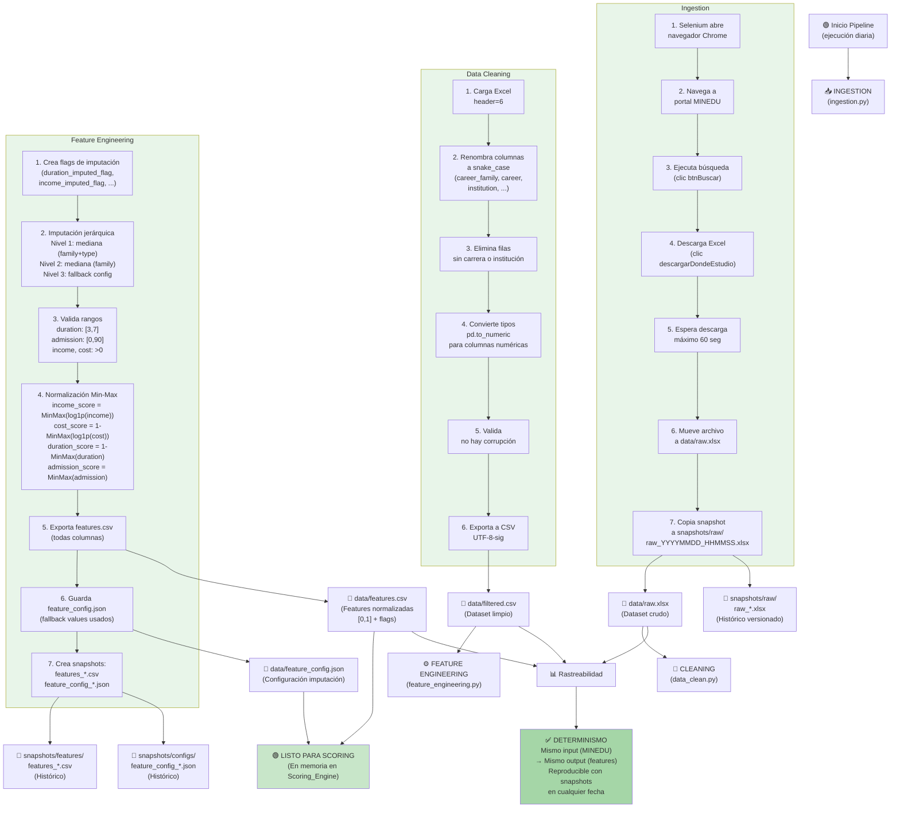
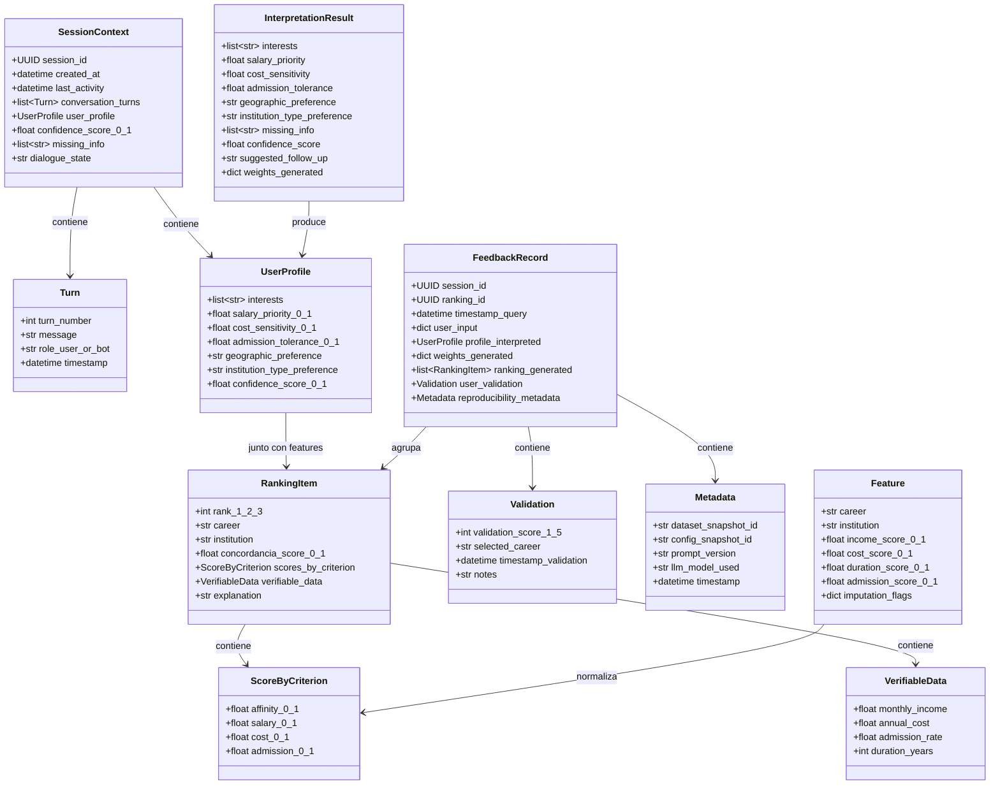
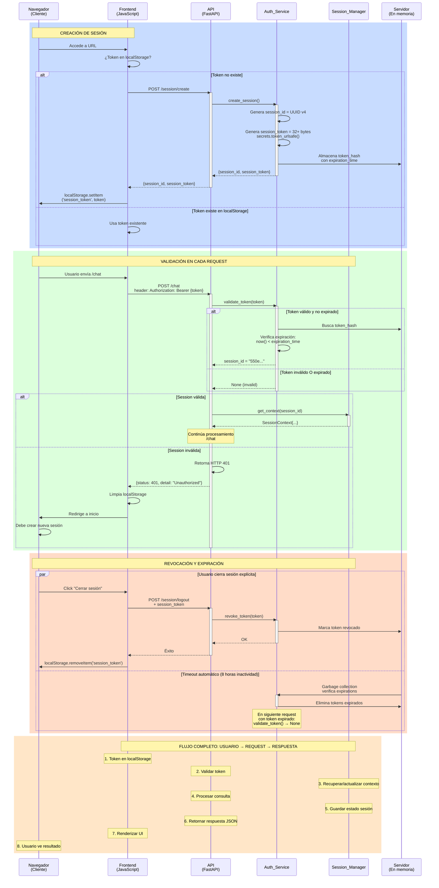
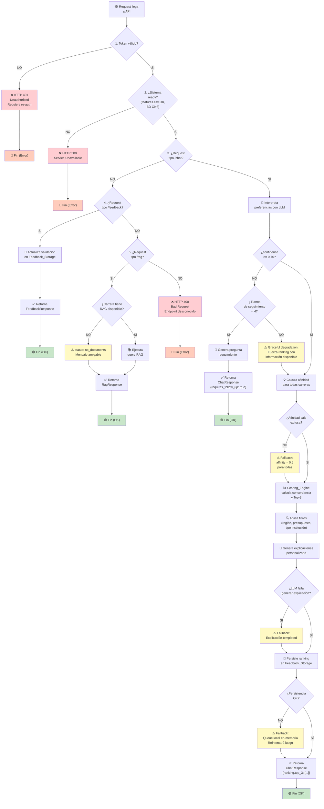

# ARCHITECTURE.md

## Descripción General de la Arquitectura

CareerMatch Perú es un sistema de recomendación de carreras universitarias que opera como una aplicación web full-stack integrada con procesamiento de datos batch y servicios de inteligencia artificial generativa. La arquitectura está diseñada bajo principios de **modularidad, reproducibilidad, transparencia y degradación controlada**.

El flujo de información sigue este patrón:

1. **Capa de Datos (Data Pipeline)**: Descarga datos oficiales de Ponte en Carrera, aplica limpieza, imputación jerárquica y normalización, generando features reproducibles y versionados.

2. **Capa de Backend (Orquestación + Servicios)**: Recibe consultas de usuarios autenticados, orquesta flujos de interpretación LLM, calcula rankings multi-criterio, persiste feedback histórico.

3. **Capa de Presentación (Frontend Web)**: Interfaz conversacional responsiva que permite al usuario expresar preferencias naturales, visualizar resultados y validar recomendaciones.

4. **Almacenamiento (Base de Datos + Snapshots Versionados)**: Persiste sesiones, rankings, validaciones y metadatos de reproducibilidad para auditoría y análisis futuro.

El sistema enfatiza **determinismo absoluto** en el ranking (mismo input → mismo output siempre), **aislamiento de datos** por usuario/sesión, y **fallback controlado** cuando componentes fallan (RAG no disponible no bloquea ranking, LLM falla utiliza templado, etc.).

---

## Diagramas de Arquitectura

### 1. Diagrama de Componentes Generales

Este diagrama muestra todos los módulos principales y cómo se relacionan:

```mermaid
graph TB
    subgraph Client["🖥️ CLIENTE"]
        BrowserUI["Navegador Web<br/>Frontend HTML+JS"]
        LocalStorage["Local Storage<br/>(session_token)"]
    end
    
    subgraph Network["🌐 RED / HTTP"]
        HTTP["HTTPS / HTTP<br/>REST API<br/>(port 8000)"]
    end
    
    subgraph Backend["⚙️ BACKEND (Python / FastAPI)"]
        subgraph Auth["🔐 Autenticación"]
            AuthSvc["Auth_Service<br/>(auth.py)<br/>Genera tokens<br/>Valida sesiones"]
        end
        
        subgraph Orchestration["🎯 Orquestación"]
            OrchSvc["Orchestration_Layer<br/>(orchestration.py)<br/>Maneja /chat, /feedback<br/>Coordina flujos<br/>Logging/auditoría"]
        end
        
        subgraph Session["📋 Sesión"]
            SessionMgr["Session_Manager<br/>(session.py)<br/>Contexto conversacional<br/>Historial de turnos<br/>Perfil acumulado"]
        end
        
        subgraph LLMComp["🤖 LLM / Interpretación"]
            LLMSvc["LLM_Layer<br/>(llm_service.py)<br/>Interpreta preferencias<br/>Genera explicaciones<br/>Pesos dinámicos"]
            
            ExternalLLM["Gemini API / OpenAI<br/>(externo)"]
            LLMSvc -->|"API call"| ExternalLLM
        end
        
        subgraph ScoringComp["📊 Scoring"]
            ScoringEng["Scoring_Engine<br/>(scoring.py)<br/>Calcula concordancia<br/>Genera ranking<br/>Aplica filtros"]
        end
        
        subgraph AfinityComp["💡 Afinidad"]
            AffinitySvc["Affinity Calculator<br/>(scoring.py)<br/>Mapeo semántico<br/>O embeddings"]
            EmbeddingSvc["Embedding_Service<br/>(embedding.py)<br/>Genera embeddings"]
            ExternalEmbed["OpenAI / Google / HF<br/>(externo)"]
            EmbeddingSvc -->|"API call"| ExternalEmbed
        end
        
        subgraph RAGComp["📚 RAG Opcional"]
            RAGMod["RAG_Module<br/>(rag.py)<br/>Consultas sobre<br/>detalles de carrera"]
            VectorDB["Vector Database<br/>(FAISS/Pinecone/Chroma)<br/>Chunks embeddeados<br/>de PDFs"]
            RAGMod -->|"búsqueda"| VectorDB
            RAGMod -->|"generación"| LLMSvc
        end
        
        subgraph Feedback["💾 Feedback"]
            FeedbackSvc["Feedback_Storage<br/>(feedback.py)<br/>Persiste rankings<br/>Validaciones usuario<br/>Metadatos"]
        end
    end
    
    subgraph DataLayer["🗄️ CAPA DE DATOS"]
        subgraph DataPipeline["📥 Pipeline de Datos"]
            Ingestion["Ingestion<br/>(ingestion.py)<br/>Descarga automatizada<br/>de Ponte en Carrera<br/>via Selenium"]
            
            Clean["Data Clean<br/>(data_clean.py)<br/>Estandarización<br/>Validación"]
            
            FeatureEng["Feature Engineering<br/>(feature_engineering.py)<br/>Imputación jerárquica<br/>Normalización"]
            
            Ingestion --> Clean --> FeatureEng
        end
        
        subgraph DataStorage["📂 Almacenamiento Datos"]
            RawXLSX["data/raw.xlsx<br/>(última descarga)"]
            FilteredCSV["data/filtered.csv<br/>(limpio)"]
            FeaturesCSV["data/features.csv<br/>(normalizado)"]
            ConfigJSON["data/feature_config.json<br/>(config imputación)"]
            
            RawXLSX --> FilteredCSV --> FeaturesCSV
            FeaturesCSV --> ConfigJSON
        end
        
        subgraph Snapshots["🔄 Snapshots Versionados"]
            RawSnaps["snapshots/raw/<br/>raw_*.xlsx"]
            FeatSnaps["snapshots/features/<br/>features_*.csv"]
            ConfigSnaps["snapshots/configs/<br/>feature_config_*.json"]
        end
        
        DataPipeline -->|"produce"| DataStorage
        DataPipeline -->|"crea"| Snapshots
    end
    
    subgraph ExternalData["🌍 DATOS EXTERNOS"]
        PonteEnCarrera["https://ponte...minedu.gob.pe<br/>Portal Oficial MINEDU<br/>Ponte en Carrera"]
    end
    
    subgraph Database["🗃️ PERSISTENCIA"]
        FeedbackDB["feedback.db<br/>SQLite / PostgreSQL<br/>Sesiones, rankings,<br/>feedback, validaciones"]
    end
    
    %% Flujos principales
    BrowserUI -->|"HTTP request<br/>+ session_token"| HTTP
    HTTP --> OrchSvc
    LocalStorage -.->|"almacena token"| BrowserUI
    
    OrchSvc -->|"valida"| AuthSvc
    OrchSvc -->|"recupera contexto"| SessionMgr
    OrchSvc -->|"interpreta preferencias"| LLMSvc
    OrchSvc -->|"calcula afinidad"| AffinitySvc
    OrchSvc -->|"ranking"| ScoringEng
    OrchSvc -->|"detalles"| RAGMod
    OrchSvc -->|"persiste"| FeedbackSvc
    
    ScoringEng -->|"carga features"| FeaturesCSV
    ScoringEng -->|"consulta config"| ConfigJSON
    
    FeedbackSvc -->|"guarda"| FeedbackDB
    
    Ingestion -->|"descarga"| PonteEnCarrera
    
    %% Respuestas
    OrchSvc -->|"JSON response"| HTTP
    HTTP -->|"renderiza UI"| BrowserUI
    
    %% Estilos
    classDef client fill:#e1f5ff,stroke:#0277bd,color:#000
    classDef network fill:#fff3e0,stroke:#e65100,color:#000
    classDef backend fill:#f3e5f5,stroke:#6a1b9a,color:#000
    classDef auth fill:#fce4ec,stroke:#c2185b,color:#000
    classDef data fill:#e8f5e9,stroke:#2e7d32,color:#000
    classDef external fill:#ffd54f,stroke:#f57f17,color:#000
    classDef db fill:#eceff1,stroke:#37474f,color:#000
    
    class BrowserUI,LocalStorage client
    class HTTP network
    class OrchSvc,AuthSvc,SessionMgr,LLMSvc,ScoringEng,AffinitySvc,EmbeddingSvc,RAGMod,FeedbackSvc backend
    class AuthSvc auth
    class DataPipeline,DataStorage,Snapshots data
    class PonteEnCarrera,ExternalLLM,ExternalEmbed external
    class FeedbackDB,VectorDB db
```



---

### 2. Diagrama de Flujo de Datos (Request / Response Completo) #TODO: corregir

Este diagrama muestra el ciclo completo de una consulta desde el usuario hasta respuesta con ranking:

```mermaid
sequenceDiagram
    participant User as 👤 Usuario<br/>(Navegador)
    participant Frontend as 🖥️ Frontend<br/>(HTML+JS)
    participant API as 📡 API<br/>(FastAPI)
    participant Auth as 🔐 Auth_Service
    participant Session as 📋 Session_Manager
    participant Orchs as 🎯 Orchestration
    participant LLMServ as 🤖 LLM_Layer
    participant External as ☁️ APIs Externas<br/>(Gemini/OpenAI)
    participant Affinity as 💡 Affinity
    participant Scoring as 📊 Scoring_Engine
    participant Features as 💾 features.csv
    participant Feedback as 💾 Feedback_Storage
    participant DB as 🗃️ feedback.db

    rect rgb(200, 220, 255)
        note over User,API: FASE 1: INICIALIZACIÓN
        User->>Frontend: Accede a URL
        activate Frontend
        Frontend->>Frontend: Lee session_token<br/>de localStorage
        alt Token existe
            Frontend->>Frontend: Token válido en cliente
        else Token no existe
            Frontend->>API: POST /session/create
            activate API
            API->>Auth: create_session()
            activate Auth
            Auth->>Auth: Genera UUID + token
            Auth-->>API: {session_id, token}
            deactivate Auth
            API-->>Frontend: {session_token}
            deactivate API
            Frontend->>Frontend: Guarda en localStorage
        end
        deactivate Frontend
    end

    rect rgb(200, 255, 220)
        note over User,Feedback: FASE 2: CONSULTA DEL USUARIO
        User->>Frontend: Escribe: "Me gustan<br/>matemáticas..."
        activate Frontend
        Frontend->>API: POST /chat<br/>{message, metadata}<br/>+ header Authorization
        deactivate Frontend
        activate API
        API->>Orchs: handle_chat()
        deactivate API
        activate Orchs
        
        Orchs->>Auth: validate_token()
        activate Auth
        Auth-->>Orchs: ✓ session_id válido
        deactivate Auth
        
        Orchs->>Session: get_context(session_id)
        activate Session
        Session-->>Orchs: SessionContext{histórico, perfil_prev}
        deactivate Session
    end

    rect rgb(255, 220, 200)
        note over LLMServ,External: FASE 3: INTERPRETACIÓN LLM
        Orchs->>LLMServ: interpret_preferences()
        activate LLMServ
        LLMServ->>LLMServ: Prepara system_prompt v1<br/>+ contexto histórico
        LLMServ->>External: API call<br/>(Gemini/OpenAI)
        activate External
        External->>External: Procesa request
        External-->>LLMServ: JSON response<br/>{interests, weights, confidence}
        deactivate External
        LLMServ->>LLMServ: Valida JSON<br/>Verifica pesos
        alt confidence >= 0.70
            LLMServ-->>Orchs: InterpretationResult<br/>{...ready_to_rank}
        else confidence < 0.70
            LLMServ->>LLMServ: Genera follow-up<br/>conversacional
            LLMServ-->>Orchs: InterpretationResult<br/>{...needs_info}
        end
        deactivate LLMServ
    end

    alt RAMA A: Información Insuficiente
        rect rgb(255, 240, 200)
            note over Orchs,Feedback: FASE 4A: SEGUIMIENTO CONVERSACIONAL
            Orchs->>Session: update_profile()
            activate Session
            Session->>Session: Merge información
            Session->>Session: Recalcula confidence
            Session-->>Orchs: OK
            deactivate Session
            
            Orchs->>Feedback: save_ranking_partial()
            activate Feedback
            Feedback->>DB: INSERT feedback
            activate DB
            DB-->>Feedback: ranking_id
            deactivate DB
            Feedback-->>Orchs: ranking_id
            deactivate Feedback
            
            Orchs->>API: ChatResponse<br/>{status: success,<br/>bot_message: follow_up,<br/>requires_follow_up: true}
            activate API
            API-->>Frontend: JSON
            deactivate API
            activate Frontend
            Frontend->>Frontend: Renderiza pregunta
            Frontend->>User: "¿Hay región donde prefieras...?"
            deactivate Frontend
            
            note over User,Feedback: Usuario responde<br/>Vuelve a FASE 2
        end
    else RAMA B: Información Suficiente
        rect rgb(200, 255, 200)
            note over Affinity,Scoring: FASE 4B: CÁLCULO DE AFINIDAD
            Orchs->>Affinity: calculate_affinity()
            activate Affinity
            Affinity->>Affinity: Mapeo semántico<br/>O embeddings<br/>de intereses vs carreras
            Affinity-->>Orchs: affinity_scores[0..n]
            deactivate Affinity
        end

        rect rgb(200, 230, 255)
            note over Scoring,Features: FASE 5: MOTOR DE SCORING
            Orchs->>Scoring: rank_all_careers()
            activate Scoring
            Scoring->>Features: Carga features.csv
            activate Features
            Features-->>Scoring: DataFrame<br/>{income_score, cost_score,<br/>admission_score, ...}
            deactivate Features
            
            Scoring->>Scoring: Para cada carrera:<br/>concordancia = w1*aff +<br/>w2*income + w3*cost + w4*adm<br/>(fórmula determinística)
            
            Scoring->>Scoring: Aplica filtros<br/>(región, presupuesto,<br/>tipo institución)
            
            Scoring->>Scoring: Ordena por<br/>concordancia DESC<br/>Selecciona Top-3
            
            Scoring-->>Orchs: Top-3 rankings<br/>{career, institution,<br/>scores, datos_verificables}
            deactivate Scoring
        end

        rect rgb(255, 230, 200)
            note over LLMServ,External: FASE 6: GENERACIÓN DE EXPLICACIONES
            Orchs->>LLMServ: generate_explanation()<br/>(para cada Top-3)
            activate LLMServ
            LLMServ->>External: API call<br/>+ datos verificables
            activate External
            External-->>LLMServ: Explicación personalizada
            deactivate External
            LLMServ-->>Orchs: [expl_1, expl_2, expl_3]
            deactivate LLMServ
        end

        rect rgb(230, 200, 255)
            note over Feedback,DB: FASE 7: PERSISTENCIA DE RANKING
            Orchs->>Feedback: save_ranking()<br/>{session_id, profile,<br/>weights, ranking, explns}
            activate Feedback
            Feedback->>Feedback: Construye FeedbackRecord
            Feedback->>DB: INSERT
            activate DB
            DB-->>Feedback: ranking_id
            deactivate DB
            Feedback-->>Orchs: ranking_id
            deactivate Feedback
        end

        rect rgb(200, 255, 230)
            note over Orchs,User: FASE 8: RESPUESTA AL USUARIO
            Orchs-->>API: ChatResponse<br/>{status: success,<br/>ranking.top_3: [...],<br/>rag_available_for: [...],<br/>ranking_id: ...}
            activate API
            API-->>Frontend: JSON
            deactivate API
            activate Frontend
            Frontend->>Frontend: Renderiza Top-3<br/>+ explicaciones<br/>+ botones Likert
            Frontend->>User: "Top-3 recomendaciones<br/>1. Estadística - UNMSM<br/>..."
            deactivate Frontend
        end
    end
    deactivate Orchs

    rect rgb(255, 200, 200)
        note over Frontend,DB: FASE 9: VALIDACIÓN DE USUARIO (FEEDBACK)
        User->>Frontend: Click: Likert 4/5
        activate Frontend
        Frontend->>API: POST /feedback<br/>{ranking_id, score: 4}
        deactivate Frontend
        activate API
        API->>Orchs: handle_feedback()
        activate Orchs
        Orchs->>Feedback: update_validation()
        activate Feedback
        Feedback->>DB: UPDATE feedback<br/>SET validation_score = 4
        activate DB
        DB-->>Feedback: OK
        deactivate DB
        Feedback-->>Orchs: OK
        deactivate Feedback
        Orchs-->>API: FeedbackResponse<br/>{status: success}
        deactivate Orchs
        API-->>Frontend: JSON
        deactivate API
        activate Frontend
        Frontend->>User: "¡Gracias por tu feedback!"
        deactivate Frontend
    end
```



---

### 3. Diagrama de Flujo de Datos (Data Pipeline) - TODO: Corregir

Este diagrama muestra cómo los datos viajan a través del pipeline batch:



---

### 4. Diagrama de Sesión y Ciclo de Vida del Usuario

Este diagrama muestra cómo una sesión nace, vive y muere:

```mermaid
stateDiagram-v2
    [*] --> Start: Usuario accede URL
    
    Start --> AuthRequired: ¿Token en localStorage?
    
    AuthRequired --> CreateSession: NO
    CreateSession --> SessionCreated: Llama /session/create<br/>Genera session_id + token<br/>Guarda en localStorage
    
    AuthRequired --> SessionActive: SÍ
    SessionCreated --> SessionActive: token + session_id
    
    SessionActive --> ChatLoop: Entra en ciclo<br/>conversacional
    
    ChatLoop --> TurnN: Turn N - Usuario envía<br/>mensaje/consulta
    
    TurnN --> LLMInterpret: LLM interpreta<br/>+ calcula confidence
    
    LLMInterpret --> ConfCheck: ¿confidence >= 0.70?
    
    ConfCheck --> NeedInfo: NO (< 0.70)
    NeedInfo --> FollowUp: Genera pregunta<br/>seguimiento
    FollowUp --> FollowUpResp: Retorna bot_message<br/>+ requires_follow_up=true
    FollowUpResp --> UpdateContext: Actualiza perfil<br/>en SessionManager
    UpdateContext --> ChatLoop
    
    ConfCheck --> Ready: SÍ (>= 0.70)
    Ready --> CalcAffinity: Calcula afinidad<br/>para todas carreras
    CalcAffinity --> CalcScore: Scoring Engine<br/>genera ranking Top-3
    CalcScore --> GenExplain: LLM genera<br/>explicaciones
    GenExplain --> PersistRanking: Persist en<br/>Feedback_Storage
    PersistRanking --> ReturnRanking: Retorna<br/>ranking_id + Top-3
    ReturnRanking --> RankingDisplay: Frontend muestra<br/>Top-3 + explicaciones<br/>+ Likert buttons
    RankingDisplay --> UserValidates: Usuario valida<br/>score Likert 1-5
    UserValidates --> PersistFeedback: POST /feedback<br/>Actualiza validación
    PersistFeedback --> FeedbackPersisted: Feedback guardado<br/>en BD
    FeedbackPersisted --> ContinueOrEnd: ¿Nueva consulta?
    
    ContinueOrEnd --> AnotherQuery: SÍ
    AnotherQuery --> ChatLoop
    
    ContinueOrEnd --> EndSession: NO
    
    EndSession --> SessionTimeout: Token expira?<br/>O usuario cierra?
    SessionTimeout --> TokenRevoked: Token revocado<br/>en servidor
    TokenRevoked --> StorageClear: localStorage limpiado<br/>en cliente
    StorageClear --> [*]
    
    style SessionActive fill:#b3e5fc
    style ChatLoop fill:#fff9c4
    style Ready fill:#c8e6c9
    style FeedbackPersisted fill:#f8bbd0
    style TokenRevoked fill:#ffccbc
```



---

### 5. Diagrama de Estructura de Datos (Schema)

Este diagrama muestra la relación entre modelos de datos principales:



---

### 6. Diagrama de Capas Verticales (Responsabilidades)

Este diagrama muestra la separación vertical de responsabilidades:

```mermaid
graph LR
    subgraph Presentation["🎨 CAPA DE PRESENTACIÓN"]
        HTMLCSSDocs["HTML + CSS"]
        JSLogic["JavaScript<br/>CareerMatchApp"]
        UIComp["Componentes UI<br/>(chat, ranking,<br/>feedback)"]
        
        HTMLCSSDocs --> JSLogic
        JSLogic --> UIComp
    end
    
    subgraph APILayer["📡 CAPA DE API"]
        FastAPIApp["FastAPI App"]
        Endpoints["Endpoints<br/>/chat, /feedback, /rag"]
        RequestValidation["Validación<br/>de requests"]
        ResponseFormat["Formato<br/>de respuestas"]
        
        FastAPIApp --> Endpoints
        Endpoints --> RequestValidation
        Endpoints --> ResponseFormat
    end
    
    subgraph Orchestration["🎯 CAPA DE ORQUESTACIÓN"]
        OrchestrationSvc["Orchestration_Layer"]
        ErrorHandling["Manejo de errores<br/>y fallback"]
        Logging["Logging<br/>y auditoría"]
        
        OrchestrationSvc --> ErrorHandling
        OrchestrationSvc --> Logging
    end
    
    subgraph Services["⚙️ CAPA DE SERVICIOS"]
        AuthService["Auth_Service<br/>(Autenticación)"]
        SessionService["Session_Manager<br/>(Contexto)"]
        LLMService["LLM_Layer<br/>(Interpretación)"]
        ScoringService["Scoring_Engine<br/>(Ranking)"]
        AffinityService["Affinity Calculator<br/>(Afinidad)"]
        EmbeddingService["Embedding_Service<br/>(Vectores)"]
        RAGService["RAG_Module<br/>(Detalles)"]
        FeedbackService["Feedback_Storage<br/>(Persistencia)"]
    end
    
    subgraph Data["📊 CAPA DE DATOS"]
        FeaturesData["features.csv<br/>(Variables normalizadas)"]
        ConfigData["feature_config.json<br/>(Config)"]
        SnapshotsData["snapshots/<br/>(Histórico versionado)"]
        FeedbackDB["feedback.db<br/>(Sesiones, rankings,<br/>validaciones)"]
        VectorDB["Vector Database<br/>(RAG)"]
    end
    
    subgraph Pipeline["🔄 CAPA DE PIPELINE"]
        IngestionJob["Ingestion<br/>(Selenium)"]
        CleaningJob["Data Clean<br/>(Estandarización)"]
        FeatureJob["Feature Engineering<br/>(Imputación +<br/>Normalización)"]
    end
    
    subgraph External["🌍 SISTEMAS EXTERNOS"]
        MINEDUPortal["MINEDU<br/>Ponte en Carrera"]
        LLMProviders["LLM APIs<br/>(Gemini/OpenAI)"]
        EmbeddingProviders["Embedding APIs<br/>(OpenAI/Google/HF)"]
    end
    
    %% Relaciones entre capas
    Presentation -->|"HTTP"| APILayer
    APILayer -->|"valida token,<br/>delega"| Orchestration
    Orchestration -->|"coordina"| Services
    Services -->|"carga/persiste"| Data
    Pipeline -->|"produce"| Data
    External -->|"proveedor"| Services
    MINEDUPortal -->|"fuente de datos"| Pipeline
    
    style Presentation fill:#e3f2fd
    style APILayer fill:#fff3e0
    style Orchestration fill:#f3e5f5
    style Services fill:#fce4ec
    style Data fill:#e8f5e9
    style Pipeline fill:#e0f2f1
    style External fill:#fff9c4
```



---

### 7. Diagrama de Flujo de Autenticación y Sesión - TODO: corregir

Este diagrama detalla cómo funciona el sistema de tokens y sesiones:



---

### 8. Diagrama de Decisiones (Branching Logic)

Este diagrama muestra los puntos clave de decisión en el sistema:



---

## Patrones de Diseño y Decisiones Clave

### 1. Desacoplamiento LLM-Scoring

**Decisión:** El **LLM_Layer** y **Scoring_Engine** son completamente independientes.

**Implicación:**
- LLM genera pesos dinámicos y explicaciones (componentes conversacionales)
- Scoring usa pesos para calcular ranking (decisión numérica y determinística)
- Puedo cambiar proveedor LLM sin afectar scoring
- Puedo cambiar fórmula de scoring sin cambiar LLM

**Beneficio:** Mayor flexibilidad y testabilidad.

---

### 2. Reproducibilidad mediante Snapshots Versionados

**Decisión:** Cada ejecución de pipeline genera snapshots con timestamp.

**Implicación:**
```
Ranking generado en timestamp T1
↓
Guarda metadatos en FeedbackRecord: snapshot_id = "20260715_143022"
↓
Evaluador puede recuperar exactamente features.csv y config usados en T1
↓
Puede reproducir ranking manualmente o con código
```

**Beneficio:** Auditoría completa, debugging, reproducibilidad científica.

---

### 3. Aislamiento de Sesión por `session_id`

**Decisión:** Cada usuario tiene `session_id` único. Datos no comparten entre sesiones.

**Implicación:**
- Session_Manager: históricos conversacionales aislados
- Feedback_Storage: querys filtran automáticamente por session_id
- SQL schema: session_id en índice primario

**Beneficio:** Privacidad garantizada, incluso si alguien accede a servidor físicamente.

---

### 4. Degradación Controlada (Graceful Degradation)

**Decisión:** Si un componente falla, sistema intenta continuar con fallback.

**Ejemplos:**
- LLM falla 3 veces → usar respuesta templated
- Afinidad calc falla → usar fallback 0.5 para todas carreras
- RAG no disponible → retornar "detalles no disponibles" sin bloquear ranking
- DB no disponible → almacenar en queue local, sincronizar cuando DB vuelva

**Beneficio:** Robustez, mejor UX (algo es mejor que nada).

---

### 5. Determinismo Absoluto en Ranking

**Decisión:** Mismo input SIEMPRE produce mismo output (mismo orden de Top-3).

**Implementación:**
- Sin randomness en scoring
- Desempate alfabético por institution name
- Mismo dataset (snapshots)
- Mismo algoritmo (Sin cambios mid-ranking)

**Beneficio:** Testing, debugging, auditoría, reproducibilidad.

---

## Flujos de Información Clave

### Flujo 1: Usuarios Nuevos (First-Time)

```
[Navegador]
    ↓
localStorage vacío
    ↓
[Frontend] llama /session/create
    ↓
[Auth_Service] genera session_id + session_token
    ↓
[Frontend] guarda token en localStorage
    ↓
[Session_Manager] crea SessionContext nuevo (vacío)
    ↓
Usuario lista para escribir consulta
```

### Flujo 2: Consulta con Información Insuficiente

```
[Usuario] "Me gustan matemáticas"
    ↓
[LLM] interpreta: confidence = 0.45 (faltan región, institución, presupuesto)
    ↓
[LLM] genera follow-up: "¿Dónde prefieres estudiar?"
    ↓
[Frontend] muestra pregunta
    ↓
[Usuario] responde: "Lima"
    ↓
[Session_Manager] actualiza perfil (merge)
    ↓
[LLM] recalcula: confidence = 0.65 (faltan institución, presupuesto)
    ↓
Vuelve a step 2 (máximo 4 turnos)
    ↓
Cuando confidence >= 0.70 o se alcanzan 4 turnos: procede a ranking
```

### Flujo 3: Ranking Determinístico

```
[Pesos] w = {aff: 0.4, sal: 0.3, costo: 0.2, adm: 0.1}
[Afinidad] A = [0.85, 0.60, 0.20, ...]
[Features] F = {income_score: [...], cost_score: [...], ...}
    ↓
Para cada carrera i:
    score[i] = 0.4*A[i] + 0.3*F[income][i] + 0.2*F[cost][i] + 0.1*F[admission][i]
    ↓
Ordena score[] DESC
Desempata: institution ASC
    ↓
Top-3 = índices con scores más altos
    ↓
¿Mismo input en otra sesión/día?
→ Mismo ranking, mismo orden
```

---

## Integración con Sistemas Externos

### LLM Providers

```
[Backend] llama LLM_Layer.interpret_preferences()
    ↓
[LLM_Layer] construye prompt + contexto
    ↓
[LLM_Layer] llama API externa (Gemini / OpenAI)
    ↓
[Externa] procesa, retorna JSON
    ↓
[LLM_Layer] parsea, valida JSON
    ↓
Si inválido (3 intentos):
    → Loguea error
    → Usa respuesta templated
    → Continúa
    ↓
Retorna InterpretationResult a Orchestration
```

### Embedding Providers

```
[RAG_Module] llama EmbeddingService.embed(texto)
    ↓
[EmbeddingService] selecciona provider (OpenAI / Google / HF local)
    ↓
Si API externa:
    → Llama API
    → Retorna vector
    ↓
Si local (HF):
    → Usa modelo cargado en memoria
    → Retorna vector
    ↓
RAG_Module usa vector para buscar en VectorDB
```

### MINEDU Portal

```
[Data Pipeline] ejecuta cada día
    ↓
[Ingestion] abre Selenium
    ↓
[Selenium] interactúa con portal MINEDU
    ↓
Si cambios en portal HTML:
    → XPath pueden fallar
    → Loguea timeout
    → Mantiene última versión conocida
    ↓
Descarga, genera snapshot, continúa
```

---

## Monitoreo y Observabilidad

### Logging Centralizado

```
Cada componente loguea eventos JSON:

{
  "timestamp": "2026-07-15T14:32:00Z",
  "level": "INFO",
  "component": "Orchestration",
  "session_id": "550e8400-...",
  "message": "Preferences interpreted",
  "data": {
    "confidence_score": 0.85,
    "weights_generated": {...}
  }
}

Destino: stdout (Docker) + archivo local (persistencia)
```

### Métricas Críticas

```
[Auth_Service]
  ├─ tokens_created (incrementa)
  ├─ tokens_validated (incrementa)
  ├─ tokens_revoked (incrementa)
  └─ tokens_expired (incrementa)

[LLM_Layer]
  ├─ interpret_calls (incrementa)
  ├─ llm_failures (incrementa)
  ├─ llm_timeouts (incrementa)
  └─ average_confidence (media)

[Scoring_Engine]
  ├─ ranking_calculations (incrementa)
  ├─ scoring_time_ms (histograma)
  └─ determinism_violations (0 siempre)

[Feedback_Storage]
  ├─ rankings_saved (incrementa)
  ├─ validations_received (incrementa)
  ├─ db_connection_errors (incrementa)
  └─ queue_local_size (gauge)
```

---

## Seguridad y Privacidad

### Flujo de Autenticación Segura

```
[Cliente] guarda session_token en localStorage (HTTPOnly si posible)
    ↓
[Cliente] incluye en header: Authorization: Bearer {token}
    ↓
[Servidor] recibe request
    ↓
[Auth_Service] valida token:
  ├─ Existe en almacén?
  ├─ Expirado?
  ├─ Hash válido?
    ↓
Si NO válido → HTTP 401 → Cliente limpia localStorage
Si SÍ válido → Retorna session_id → Continúa procesamiento
```

### Aislamiento de Datos

```
[Usuario A] hace request (session_id_A)
    ↓
[Session_Manager] filtra por session_id_A
    ↓
[Feedback_Storage] WHERE session_id = 'A' (siempre)
    ↓
[Usuario B] con session_id_B
    ↓
Incluso si Usuario B accede DB físicamente:
  → Schema tiene índice (session_id)
  → Queries automáticas filtran por session_id
  → Usuario A datos son inaccesibles
```

### Logging Seguro

```
NUNCA loguear:
  ❌ Tokens completos
  ❌ API keys
  ❌ Datos PII (nombres reales de usuarios)

SÍ loguear:
  ✅ session_id (anónimo)
  ✅ Timestamps
  ✅ Nombres de carreras (públicos)
  ✅ Scores, pesos (no PII)
```

---

## Resiliencia y Failover

### Disponibilidad en Demo

```
Target: Best effort (no SLA)

Pero aplicar defensas:
  ├─ Timeout de 5 segundos en /chat
  ├─ Reintentos exponenciales (1s, 2s, 4s) en APIs externas
  ├─ Fallback templated si LLM falla
  ├─ Fallback affinity 0.5 si embedding falla
  ├─ Queue local si DB no disponible
  └─ Respuesta parcial mejor que error
```

### Escalabilidad a Producción

```
Si crecimiento a 10,000+ usuarios:
  ├─ Session_Manager → Redis (en lugar de en-memory)
  ├─ Feedback_Storage → PostgreSQL con replicación
  ├─ Scoring_Engine → caché de features pre-cargado
  ├─ LLM calls → rate limiting, queue de trabajo
  ├─ Frontend → CDN estático, servidor separado
  └─ Docker → Kubernetes con auto-scaling
```

---