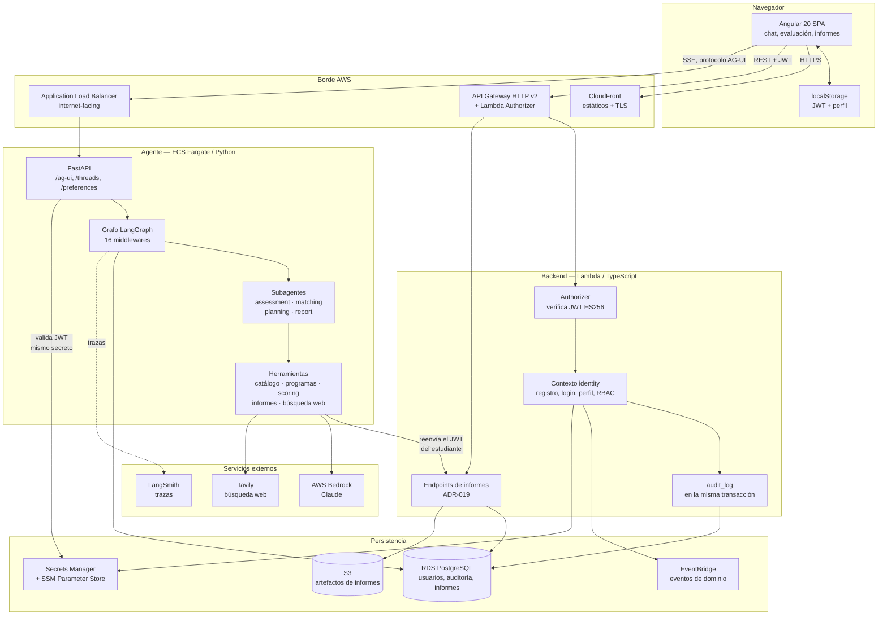
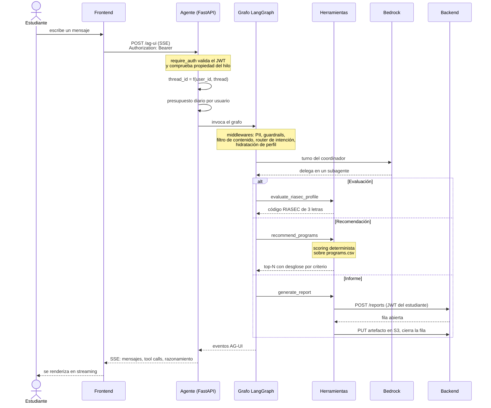
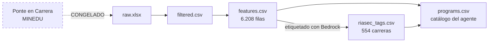
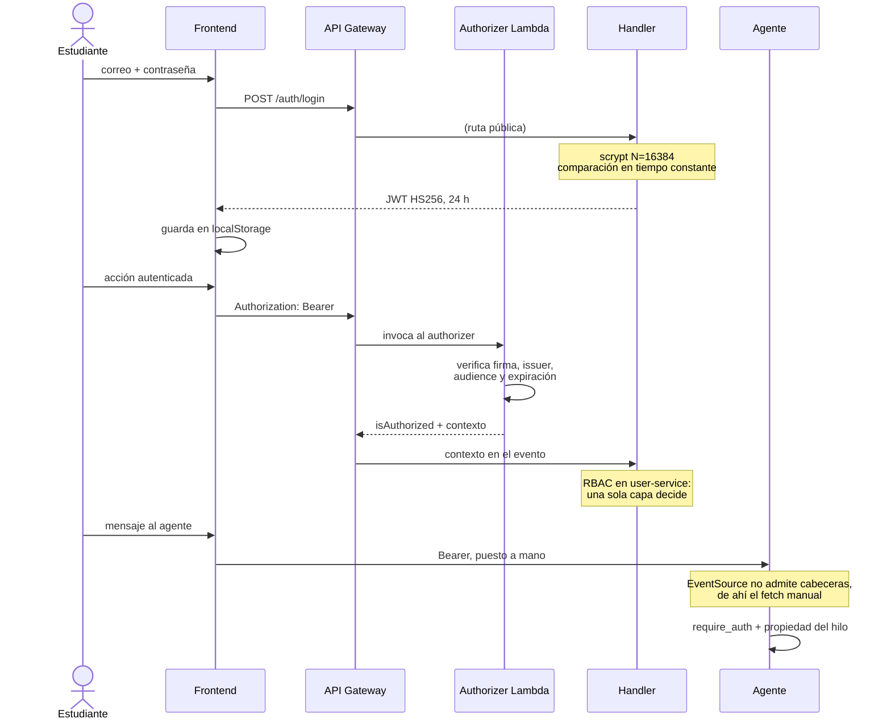

# ARCHITECTURE.md

> **Alcance.** Arquitectura de la plataforma completa: frontend, backend, agente,
> pipeline de datos e infraestructura. Para el detalle interno del backend, ver
> [`spark-match-03-backend/docs/architecture.md`](https://github.com/spark-match/spark-match-03-backend/blob/main/docs/architecture.md).
>
> **Última verificación contra el código: 31 de agosto de 2026**, sobre `main` de
> los ocho repositorios. Cada afirmación técnica de este documento se contrastó
> con el código en esa fecha. La sección [Diseño objetivo vs. estado real](#diseño-objetivo-vs-estado-real)
> recoge lo que está descrito pero no implementado.

---

## Descripción general

Spark Match es un copiloto de orientación vocacional. Un estudiante conversa con
un agente que le hace una evaluación RIASEC, le calcula afinidad contra un
catálogo real de programas universitarios peruanos y le arma un plan de acción.

La plataforma son **cuatro servicios desplegables** más un pipeline de datos por
lotes, en repositorios separados:

| Pieza | Repositorio | Stack | Cómo se despliega |
|---|---|---|---|
| Frontend | `04-frontend` | Angular 20 | S3 + CloudFront |
| Backend | `03-backend` | TypeScript, Node | AWS Lambda vía SAM |
| Agente | `07-deep-agent` | Python 3.14 | ECS Fargate ARM64 tras ALB |
| Infraestructura | `02-infrastructure` | Terraform | 16 módulos, `dev` y `prod` |
| Pipeline de datos | `05-data-pipeline` | Python, DVC | Por lotes, fuera de AWS |

Dos decisiones dan forma a todo lo demás:

**El backend y el agente son procesos distintos, en lenguajes distintos**
(ADR-001). El backend es serverless y transaccional: identidad, autorización,
auditoría, registro de informes. El agente es un proceso largo con estado
conversacional, que no encaja en el modelo de ejecución de Lambda. El agente
nunca habla con la base de datos del backend; le habla por HTTP, reenviando el
JWT del propio estudiante.

**El ranking es determinista y vive fuera del LLM.** El modelo interpreta,
conversa y explica; el orden de las recomendaciones lo calcula código Python
puro y auditable. Mismo perfil, mismo catálogo, mismo resultado, siempre.

---

## Vista de componentes

```mermaid
graph TB
    subgraph Cliente["Navegador"]
        SPA["Angular 20 SPA<br/>chat, evaluación, informes"]
        LS["localStorage<br/>JWT + perfil"]
        SPA <--> LS
    end

    subgraph Edge["Borde AWS"]
        CF["CloudFront<br/>estáticos + TLS"]
        ALB["Application Load Balancer<br/>internet-facing"]
        APIGW["API Gateway HTTP v2<br/>+ Lambda Authorizer"]
    end

    subgraph Backend["Backend — Lambda / TypeScript"]
        AUTH["Authorizer<br/>verifica JWT HS256"]
        IDENT["Contexto identity<br/>registro, login, perfil, RBAC"]
        REPORTS["Endpoints de informes<br/>ADR-019"]
        AUDIT["audit_log<br/>en la misma transacción"]
    end

    subgraph Agente["Agente — ECS Fargate / Python"]
        API["FastAPI<br/>/ag-ui, /threads, /preferences"]
        GRAPH["Grafo LangGraph<br/>16 middlewares"]
        SUB["Subagentes<br/>assessment · matching<br/>planning · report"]
        TOOLS["Herramientas<br/>catálogo · programas · scoring<br/>informes · búsqueda web"]
        GRAPH --> SUB --> TOOLS
    end

    subgraph Datos["Persistencia"]
        RDS[("RDS PostgreSQL<br/>usuarios, auditoría, informes")]
        S3R[("S3<br/>artefactos de informes")]
        SM["Secrets Manager<br/>+ SSM Parameter Store"]
        EB["EventBridge<br/>eventos de dominio"]
    end

    subgraph Externos["Servicios externos"]
        BR["AWS Bedrock<br/>Claude"]
        TV["Tavily<br/>búsqueda web"]
        LSM["LangSmith<br/>trazas"]
    end

    SPA -->|"HTTPS"| CF
    SPA -->|"REST + JWT"| APIGW
    SPA -->|"SSE, protocolo AG-UI"| ALB
    APIGW --> AUTH --> IDENT
    APIGW --> REPORTS
    IDENT --> AUDIT --> RDS
    IDENT --> EB
    REPORTS --> RDS
    REPORTS --> S3R
    ALB --> API --> GRAPH
    API -->|"valida JWT<br/>mismo secreto"| SM
    GRAPH --> RDS
    TOOLS -->|"reenvía el JWT<br/>del estudiante"| REPORTS
    TOOLS --> BR
    TOOLS --> TV
    GRAPH -.->|"trazas"| LSM
    IDENT --> SM
```

---

## Flujo de una consulta

Desde que el estudiante escribe hasta que ve la recomendación:

```mermaid
sequenceDiagram
    actor E as Estudiante
    participant F as Frontend
    participant A as Agente (FastAPI)
    participant G as Grafo LangGraph
    participant T as Herramientas
    participant B as Bedrock
    participant BE as Backend

    E->>F: escribe un mensaje
    F->>A: POST /ag-ui (SSE)<br/>Authorization: Bearer
    Note over A: require_auth valida el JWT<br/>y comprueba propiedad del hilo
    A->>A: thread_id = f(user_id, thread)
    A->>A: presupuesto diario por usuario

    A->>G: invoca el grafo
    Note over G: middlewares: PII, guardrails,<br/>filtro de contenido, router de intención,<br/>hidratación de perfil

    G->>B: turno del coordinador
    B-->>G: delega en un subagente

    alt Evaluación
        G->>T: evaluate_riasec_profile
        T-->>G: código RIASEC de 3 letras
    else Recomendación
        G->>T: recommend_programs
        Note over T: scoring determinista<br/>sobre programs.csv
        T-->>G: top-N con desglose por criterio
    else Informe
        G->>T: generate_report
        T->>BE: POST /reports (JWT del estudiante)
        BE-->>T: fila abierta
        T->>BE: PUT artefacto en S3, cierra la fila
    end

    G-->>A: eventos AG-UI
    A-->>F: SSE: mensajes, tool calls, razonamiento
    F-->>E: se renderiza en streaming
```

Lo que importa de este flujo: **el LLM decide *qué* herramienta usar, no *qué*
carrera recomendar.** Cuando llama a `recommend_programs`, recibe de vuelta un
ranking ya calculado y su desglose numérico; su trabajo a partir de ahí es
explicarlo en lenguaje natural, no reordenarlo.

---

## El motor de recomendación

Vive en `07-deep-agent/src/tools/recommendation/scoring.py`. Es código puro, sin
dependencias del LLM, y por tanto testeable y auditable.

**Cuatro criterios ponderados:**

| Criterio | Peso | Qué mide |
|---|---|---|
| `riasec_affinity` | 0.50 | Similitud entre el perfil del estudiante y el de la carrera |
| `income` | 0.20 | Ingreso mensual esperado del egresado |
| `admission_accessibility` | 0.20 | Tasa de admisión — cuán alcanzable es entrar |
| `affordability` | 0.10 | Costo anual, invertido |

La afinidad RIASEC usa ponderación posicional: la primera letra del código pesa
más que la tercera, y una coincidencia en la misma posición puntúa por encima de
una coincidencia desplazada. El puntaje se normaliza **contra el auto-match del
propio perfil**, no contra una constante: un código degenerado con letras
repetidas puede puntuar más alto contra sí mismo de lo que una constante fija
permitiría, y con denominador fijo eso se salía del 100 %.

Los otros tres criterios se normalizan contra **percentiles 5 y 95 del dataset**,
calculados solo sobre las filas con medición real — se excluyen las imputadas a
propósito, porque son medianas de familia y comprimen la distribución. Un
programa sin el dato recibe `NEUTRO` (0.5): ni ayuda ni penaliza.

**La duración no es un criterio.** Aparece en el dataset y en documentación
anterior, pero no entra en `WEIGHTS`.

---

## Pipeline de datos

```mermaid
graph LR
    PEC["Ponte en Carrera<br/>MINEDU"]
    RAW["raw.xlsx"]
    CLEAN["filtered.csv"]
    FEAT["features.csv<br/>6.208 filas"]
    TAGS["riasec_tags.csv<br/>554 carreras"]
    PROG["programs.csv<br/>catálogo del agente"]

    PEC -.->|"CONGELADO"| RAW
    RAW --> CLEAN --> FEAT
    FEAT -->|"etiquetado con Bedrock"| TAGS
    FEAT --> PROG
    TAGS --> PROG

    style PEC stroke-dasharray: 5 5
```

Cuatro etapas declaradas en `dvc.yaml`: `ingest`, `clean`, `features`, `riasec`.
El dataset es carrera × institución: «Ingeniería de Sistemas» aparece decenas de
veces, una por universidad, con su costo, ingreso esperado, tasa de admisión y
duración.

**La ingesta está congelada.** MINEDU retiró el portal
`ponteencarrera.minedu.gob.pe` en julio de 2026 y el upstream devuelve HTTP 500.
La etapa está marcada `frozen: true` en DVC y el `DataSource` lanza
`SourceFetchError`. Las etapas siguientes se reproducen contra el `raw.xlsx`
histórico versionado en git. Cualquier actualización del catálogo requiere una
fuente nueva; la investigación está en `05-data-pipeline/src/sources/README.md`.

El etiquetado RIASEC lo hace un LLM en Bedrock —el mismo cliente `ChatBedrock`
que usa el agente, para compartir una sola ruta de autenticación y un solo
formato de id de modelo—. Cada carrera queda marcada con su procedencia en
`riasec_source`, de modo que una etiqueta generada nunca se confunde con una
validada a mano.

---

## Almacenamiento

| Dato | Dónde | Notas |
|---|---|---|
| Usuarios, roles, estado | RDS PostgreSQL, esquema `identity` | Migraciones con `node-pg-migrate` |
| Auditoría | `identity.audit_log` | Escrita en la **misma transacción** que la mutación |
| Informes (registro) | RDS, vía backend | El backend es el registro; el agente solo lo consume |
| Informes (artefactos) | S3, bucket privado | Cifrado, con logs de acceso |
| Estado conversacional | Checkpointer de LangGraph | Ver perfiles abajo |
| Memoria de largo plazo | Store de LangGraph | Perfil y preferencias del estudiante |
| Secretos | Secrets Manager, ARN en SSM | Terraform lee el ARN, **nunca el valor** |
| Datasets | Git + DVC | `programs.csv` viaja en la imagen del agente |

**Tres perfiles de persistencia** (`src/persistence/factory.py`), elegidos por
`SPARK_PERSISTENCE_BACKEND`:

- `memory` — todo en RAM. Para tests.
- `sqlite` — fichero local. **Ni `memory` ni `sqlite` tocan AWS**, para que el
  evaluador del TFP pueda correr el repositorio sin una cuenta.
- `postgres` — perfil de producción. Resuelve el DSN por SSM → Secrets Manager.
  Es el único donde la memoria de largo plazo sobrevive a un reinicio.

Sobre los secretos: Terraform lee el **ARN**, nunca el valor. Si el valor se
creara con `aws_secretsmanager_secret_version` quedaría en claro dentro del
tfstate, que vive en S3 con versionado — borrarlo después no serviría, porque
quedan las versiones anteriores del objeto. El valor lo pone una persona, una
vez, fuera del pipeline.

---

## Autenticación y autorización

```mermaid
sequenceDiagram
    actor E as Estudiante
    participant F as Frontend
    participant GW as API Gateway
    participant AZ as Authorizer Lambda
    participant H as Handler
    participant AG as Agente

    E->>F: correo + contraseña
    F->>GW: POST /auth/login
    GW->>H: (ruta pública)
    Note over H: scrypt N=16384<br/>comparación en tiempo constante
    H-->>F: JWT HS256, 24 h
    F->>F: guarda en localStorage

    E->>F: acción autenticada
    F->>GW: Authorization: Bearer
    GW->>AZ: invoca al authorizer
    AZ->>AZ: verifica firma, issuer,<br/>audience y expiración
    AZ-->>GW: isAuthorized + contexto
    GW->>H: contexto en el evento
    Note over H: RBAC en user-service:<br/>una sola capa decide

    E->>F: mensaje al agente
    F->>AG: Bearer, puesto a mano
    Note over AG: EventSource no admite cabeceras,<br/>de ahí el fetch manual
    AG->>AG: require_auth + propiedad del hilo
```

Puntos concretos:

- **Contraseñas con scrypt** (N=16384, r=8, p=1), asíncrono para no bloquear el
  event loop de Lambda, comparación con `timingSafeEqual`. Los parámetros viajan
  dentro del hash, de modo que subirlos no invalida los existentes.
- **JWT HS256 con `jose`**, validando emisor y audiencia además de la firma. El
  secreto mínimo es de 32 bytes, comprobado antes de firmar.
- **Doble verificación**: el Lambda Authorizer valida antes de que la petición
  llegue al handler, y `requireAuth` vuelve a comprobar dentro. La segunda existe
  para invocación directa y desarrollo local.
- **RBAC en una sola capa.** Toda la autorización vive en `user-service.ts`, no
  repartida por handlers. La auditoría se escribe dentro de la misma transacción
  que la mutación: si la operación revierte, el registro también.
- **El agente valida, no emite.** Lee de SSM el mismo secreto que usa el backend,
  así que técnicamente podría firmar tokens. No lo hace: eso convertiría un
  secreto de *validación* en capacidad de *emisión* en dos servicios, y a partir
  de ahí cualquier fallo del agente sería una suplantación. Reenvía el token que
  el estudiante ya presentó.
- **Los hilos tienen dueño.** El `thread_id` real se deriva de
  `(user_id, thread_id del cliente)`, así que un identificador adivinado no
  alcanza la conversación de otra persona.

---

## Defensas del agente

El grafo lleva **16 middlewares**. Los que no son de fontanería:

| Middleware | Qué hace |
|---|---|
| `PIIRedactionMiddleware` | Redacta datos personales antes de que salgan del proceso |
| `GuardrailsMiddleware` | Frena salidas fuera de dominio |
| `ContentFilterMiddleware` | Filtra contenido inapropiado |
| `MaxTurnsMiddleware` | Corta la conversación al llegar al tope de turnos |
| `AssessmentOnceMiddleware` | Impide repetir la evaluación dentro de una sesión |
| `ReportGateMiddleware` | Exige perfil completo antes de emitir un informe |
| `IntentRouterMiddleware` | Enruta al subagente correcto |
| `ProfileHydration` / `ProfilePersist` | Carga y guarda el perfil del estudiante |

Además: límite de peticiones por IP, cabeceras de seguridad, y **presupuesto
diario por usuario** sobre el número de invocaciones.

---

## Integraciones externas

**AWS Bedrock** es el único proveedor de LLM. No hay Gemini ni OpenAI en el
código. El mismo cliente `ChatBedrock` lo usan el agente y el etiquetado RIASEC
del pipeline.

**Tavily** para búsqueda web, con DuckDuckGo como fallback declarado. Conviene
saber que el fallback **no degrada, se apaga**: en las pruebas del equipo
DuckDuckGo devolvía cero resultados, no peores. Sin la API key de Tavily,
cualquier pregunta que dependa de información actual queda sin responder.

**LangSmith** para trazas, opcional y apagado por defecto. Una traza lleva la
conversación entera, incluido lo que escribe el estudiante: activarlo es una
decisión con implicaciones de privacidad, no solo de observabilidad.

**No hay base de datos vectorial ni RAG** en ninguna parte de la plataforma. El
conocimiento sobre carreras vive en Markdown con frontmatter y en `programs.csv`,
y se consulta con herramientas deterministas.

---

## Patrones y decisiones clave

**Desacoplamiento LLM–scoring.** El ranking no pasa por el modelo. Esto es lo que
hace la recomendación reproducible y defendible: se puede explicar por qué una
carrera quedó tercera enseñando cuatro números.

**Degradación controlada.** Sin Tavily, el agente sigue conversando. Sin
LangSmith, sigue funcionando sin trazas. Sin un dato de costo o ingreso, ese
criterio pasa a neutro en lugar de descartar el programa.

**Eventos de dominio.** El backend publica en EventBridge al confirmar una
transacción — registro, login, cambio de contraseña, cambio de rol. Hoy nadie los
consume; existen para que un consumidor futuro no obligue a tocar el contexto de
identidad.

**Reproducibilidad de datos.** DVC declara el grafo de etapas, y los snapshots
fechados de features y configuración permiten reconstruir qué datos produjeron un
resultado.

**Aislamiento por usuario.** Derivación del `thread_id`, comprobación de
propiedad y presupuesto por usuario. El identificador que manda el cliente es una
sugerencia, no una credencial.

---

## Observabilidad

- **Backend**: AWS Lambda Powertools — logger estructurado y tracer por función.
  Auditoría de negocio en `identity.audit_log`, separada de los logs de
  aplicación.
- **Agente**: logging centralizado y LangSmith opcional. Una traza captura
  mensajes, llamadas a herramientas, razonamiento y delegación en subagentes.
- **Infraestructura**: CloudWatch y AWS Budgets con alertas por SNS.
- **Cadena de suministro**: SBOM, CodeQL, Trivy, gitleaks y firma con cosign en
  CI.

---

## Resiliencia

La red **no** es el control de acceso del agente. El ALB es internet-facing a
propósito, porque el navegador del estudiante no tiene IP de origen fija; la
autorización la hace el JWT que `/ag-ui` valida. Esa afirmación es hoy cierta:
conviene mantenerla verificada, porque si el endpoint dejara de validar, la
postura de red no compensaría.

El agente corre en Fargate ARM64. En `dev` las tareas van en subredes públicas
con IP pública para evitar el coste de un NAT; en `prod`, en subredes privadas
con salida por NAT. En ambos casos el grupo de seguridad solo admite tráfico
entrante desde el ALB.

**Límite conocido:** los contadores de presupuesto de búsqueda web viven en
memoria del proceso, así que el tope es por réplica y no por flota.

---

## Diseño objetivo vs. estado real

Esta sección existe porque la versión anterior de este documento describía un
sistema que nunca se construyó. Lo que sigue está verificado el 31/08/2026.

| Área | Estado |
|---|---|
| Frontend, agente, infraestructura | Implementados |
| Backend — contexto `identity` | Implementado con tests |
| Backend — otros contextos acotados | **No implementados.** `identity` es el único; los informes son endpoints, no un contexto propio |
| Motor de scoring | Implementado, **4 criterios** (la duración no pondera) |
| Catálogo de programas | 6.208 filas carrera × institución, 554 carreras etiquetadas |
| Ingesta de datos | **Congelada.** MINEDU retiró el portal |
| Entrenamiento de modelos | **No existe.** No hay MLflow ni W&B; el repositorio que iba a alojarlo se eliminó por estar vacío |
| RAG / base vectorial | **No existe** y no está planeado |
| Consumidores de eventos de dominio | **Ninguno.** Los eventos se publican, nadie los lee |

---

## Documentos relacionados

- [`03-backend/docs/architecture.md`](https://github.com/spark-match/spark-match-03-backend/blob/main/docs/architecture.md) — interior del backend: contextos acotados, eventos, almacenamiento
- [`decisions/ADR-001`](../../decisions/ADR-001-backend-hibrido-lambda-mas-agente.md) — por qué backend y agente son procesos separados
- [`decisions/ADR-003`](../../decisions/ADR-003-branch-based-deployment.md) — despliegue por rama, un solo ambiente AWS
- [`4_reglas-negocio-agente.md`](4_reglas-negocio-agente.md) — reglas de negocio del agente
- `02-infrastructure/docs/IAM_ROLES.md` — roles y confianza OIDC

---

## Mantener este documento honesto

Se desactualizó una vez y el resultado fue un SDD que describía un producto
distinto del construido. Para que no vuelva a pasar:

1. **Verificar contra el código antes de editar**, no contra el documento previo.
2. **Fechar la verificación** en la cabecera, con la rama comprobada.
3. **Lo no implementado va en [Diseño objetivo vs. estado real](#diseño-objetivo-vs-estado-real)**,
   nunca en presente de indicativo en el cuerpo del documento.
4. **Un cambio de arquitectura y su ADR entran en el mismo pull request.**
