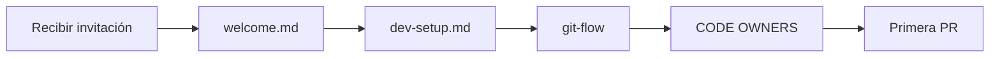

# 👋 MOC — Onboarding

> Material de bienvenida y setup del entorno para nuevos miembros del equipo.

---

## 📊 Resumen

```dataview
TABLE
  author as "Autor",
  date as "Fecha",
  status as "Status"
FROM "onboarding"
WHERE contains(tags, "area/onboarding") AND tags != "moc"
SORT date DESC
```

## 🚀 Flujo recomendado para nuevos miembros



## 📚 Documentos clave

```dataview
LIST
FROM "onboarding"
WHERE contains(tags, "area/onboarding") AND tags != "moc"
SORT date DESC
```

## 📖 Guías de configuración inicial

```dataview
LIST
FROM "guides"
WHERE contains(tags, "area/guides") AND contains(tags, "topic/onboarding")
SORT date DESC
```

## 🏛️ Gobernanza

```dataview
LIST
FROM ""
WHERE contains(tags, "topic/governance")
SORT date DESC
```

## 📚 Convenciones del equipo

```dataview
LIST
FROM "admin"
WHERE contains(tags, "area/conventions")
SORT date DESC
```

## 🔗 Wikilinks relacionados

- [[00 - Home]]
- [[MOC-guides]]
- [[onboarding/welcome]]
- [[onboarding/dev-setup]]
- [[CONTRIBUTING]]

## 📝 Changelog

| Fecha | Cambio | Autor |
|---|---|---|
| 2026-07-09 | Creación inicial del MOC | @tech-leads |
